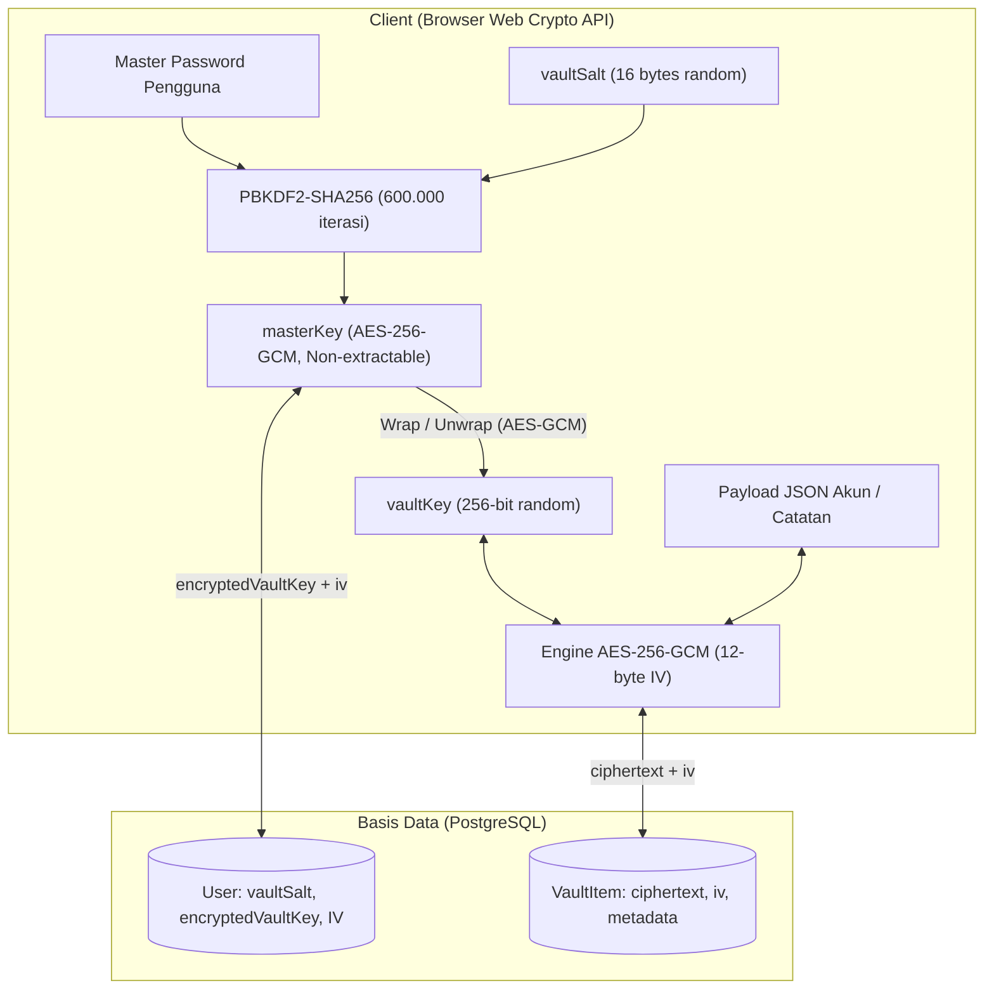
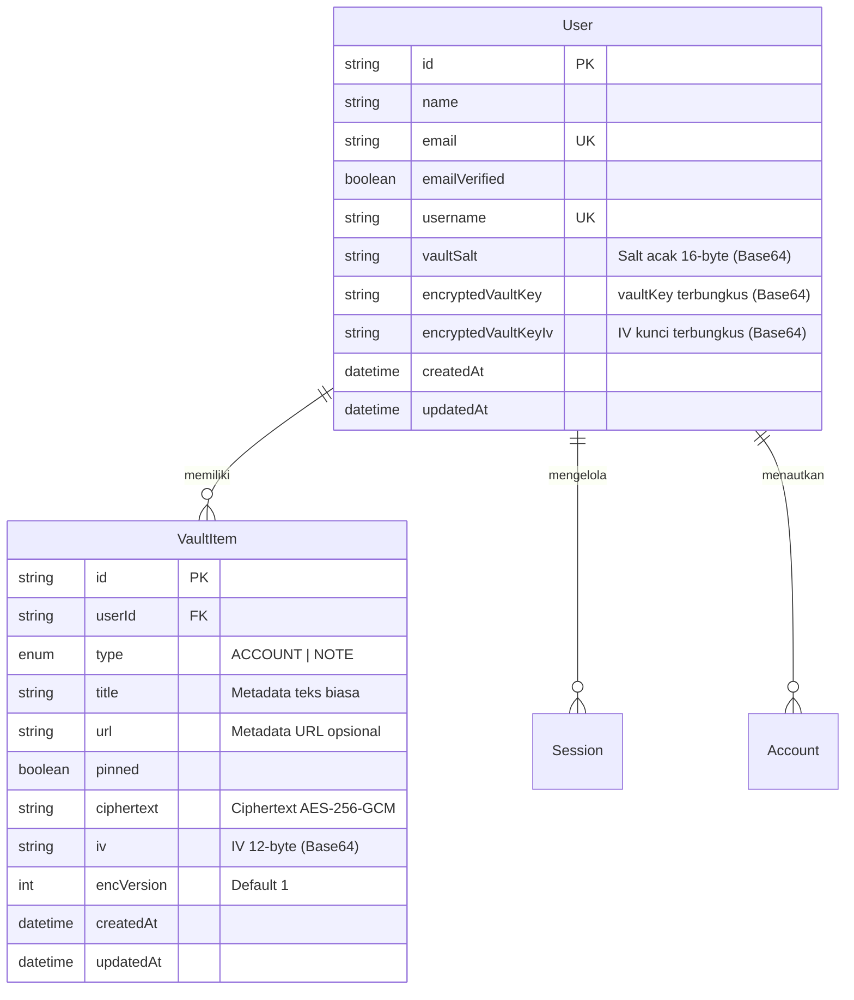

# 📄 Dokumen Kebutuhan Produk (PRD): Centinela

**Versi Dokumen:** 1.3.0  
**Proyek:** Centinela  
**Klasifikasi:** Keamanan / Pengelola Kata Sandi & Rahasia (_Password & Secrets Manager_)  
**Status:** Produksi / Pengembangan Aktif  
**Penulis:** Joko Santoso  
**Bahasa Lain:** [English Version](PRD.md)

---

## 1. Ringkasan Eksekutif

Centinela adalah aplikasi pengelola kata sandi dan catatan rahasia berbasis web dengan arsitektur **Zero-Knowledge Encryption**. Seluruh data sensitif dienkripsi langsung di sisi pengguna (browser client) sebelum dikirim melalui jaringan, sehingga server backend maupun basis data hanya menyimpan _ciphertext_ (data terenkripsi yang tidak dapat dibaca).

### Nilai Inti Produk

- **Zero-Knowledge Murni:** Bahkan jika basis data bocor total atau server disusupi pihak ketiga, data kredensial pengguna tetap aman dan tidak dapat didekripsi tanpa _Master Password_ milik pengguna.
- **Envelope Encryption (Key Wrapping):** Memisahkan kunci turunan pengguna (_Master Key_) dari kunci utama brankas (_Vault Key_), memungkinkan penggantian Master Password secara instan tanpa perlu mengenkripsi ulang ratusan item brankas.
- **Fleksibilitas Identitas:** Mendukung berbagai format akun modern (username, nomor anggota, ID akun, nomor telepon) di samping pasangan standar email dan kata sandi.

---

## 2. Model Ancaman & Invarian Keamanan

### 2.1. Invarian Keamanan (Aturan Mutlak)

1. **Nol Plaintext di Jaringan & Disk:** Kata sandi, PIN, dan catatan dalam bentuk teks mentah (_plaintext_) tidak pernah keluar dari peramban (browser) dalam kondisi tidak terenkripsi.
2. **Isolasi Master Password:** Master Password tidak pernah dikirim, tidak pernah di-hash di server, dan tidak pernah disimpan di mana pun.
3. **Masa Hidup Kunci di Memori (RAM):** Kunci kriptografi (`masterKey`, `vaultKey`) hanya hidup di memori sementara browser (React Context) dan langsung terhapus saat halaman di-refresh, brankas dikunci, atau sesi keluar (_sign out_).
4. **Perlindungan Integritas (Anti-Tamper):** Keaslian dan integritas ciphertext diproteksi menggunakan _authentication tag_ bawaan algoritma AES-256-GCM.

### 2.2. Matriks Mitigasi Ancaman

| Skenario Ancaman                                   | Tingkat Risiko | Strategi Mitigasi                                                                                                           |
| :------------------------------------------------- | :------------- | :-------------------------------------------------------------------------------------------------------------------------- |
| **Kebocoran Basis Data (Database Leak)**           | Kritis         | Penyerang hanya mendapatkan ciphertext AES-GCM, IV acak, dan salt PBKDF2. Data tetap tidak dapat dibaca secara matematis.   |
| **Server Jahat / Orang Dalam (Malicious Insider)** | Tinggi         | Server tidak memiliki akses kunci apa pun untuk mendekripsi isi brankas pengguna.                                           |
| **Man-in-the-Middle (MITM)**                       | Sedang         | Data telah terenkripsi end-to-end di sisi client sebelum dikirim melalui protokol HTTPS.                                    |
| **Serangan Kamus / Brute-Force**                   | Tinggi         | Penggunaan algoritma PBKDF2-HMAC-SHA256 dengan 600.000 iterasi membuat biaya komputasi per tebakan sangat lambat dan mahal. |
| **Ekstraksi Kunci via Serangan XSS**               | Tinggi         | Kunci ditandai `extractable: false` pada Web Crypto API dan tidak pernah disimpan ke `localStorage` atau `sessionStorage`.  |

---

## 3. Arsitektur Kriptografi



### Parameter & Spesifikasi Kriptografi

| Komponen                     | Spesifikasi Teknis                              | Standar / Referensi                         |
| :--------------------------- | :---------------------------------------------- | :------------------------------------------ |
| **Penyedia API Kriptografi** | W3C Web Crypto API (`window.crypto.subtle`)     | Native C++ pada mesin peramban modern       |
| **Derivasi Kunci (KDF)**     | PBKDF2 dengan HMAC-SHA256                       | Panduan Penyimpanan Password OWASP          |
| **Jumlah Iterasi KDF**       | 600.000 putaran                                 | Rekomendasi Minimum OWASP (2023+)           |
| **Master Key (Pembungkus)**  | AES-GCM 256-bit (`extractable: false`)          | Kunci pembungkus (_Key-wrapping key_)       |
| **Vault Key (Kunci Utama)**  | AES-GCM 256-bit acak                            | Kunci enkripsi isi brankas                  |
| **Pembuatan IV**             | 12 bytes (96 bits) via `crypto.getRandomValues` | Unik dan acak per operasi enkripsi          |
| **Format Serialisasi**       | String ter-encode Base64                        | Transmisi jaringan & penyimpanan basis data |

---

## 4. Peta Alur Sistem Lengkap & Siklus Kriptografi

### 4.1. Alur Autentikasi & Akun

#### A. Alur Pendaftaran Akun (Sign-Up)

1. **Pengisian Formulir:** Pengguna memasukkan Nama Lengkap, Email, Username (dengan slugifikasi otomatis dan verifikasi ketersediaan secara berkala/debounced), serta Kata Sandi Akun.
2. **Hook Basis Data (`beforeCreate`):** Server otomatis men-generate **`vaultSalt` unik 16 bytes** menggunakan `crypto.getRandomValues(new Uint8Array(16))`, diubah ke Base64 dan disimpan di tabel pengguna.
3. **Pengiriman Email Verifikasi:** Better Auth membuat token JWT stateless bertanda tangan digital (masa berlaku 1 jam) dan mengirimkannya via Resend SMTP.
4. **Pencegahan Spam & Rate Limiting Client:** Timestamp pengiriman (`Date.now()`) dicatat ke `localStorage` dengan kunci `verify_email_cooldown_${email.toLowerCase()}`. Pengguna diarahkan ke `/verify-email?email=...`.

#### B. Alur Verifikasi Email (`/verify-email`)

1. **Validasi Sisi Server:**
   - Jika pengguna sudah terverifikasi: otomatis diarahkan ke `/login?verified=true`.
   - Jika email tidak valid atau akun tidak ditemukan: dialihkan ke `/login`.
2. **Sinkronisasi Cooldown (`useSyncExternalStore`):**
   - Komponen formulir menyinkronkan status dengan `localStorage` dan interval detak 1 detik tanpa memicu _cascading render_ atau _hydration mismatch_.
   - Tombol pengiriman ulang dinonaktifkan dengan hitungan mundur aktif (`Resend email in 59s...`).
   - **Anti-Bypass & Anti-Refresh:** Tindakan me-refresh halaman (F5), membuka tab baru, maupun menutup peramban tidak akan menghilangkan sisa waktu hitungan mundur.
   - Setelah 60 detik berlalu, data storage dibersihkan dan tombol berubah aktif menjadi `Resend verification email`.
3. **Penyelesaian Verifikasi:** Menekan tautan pada email memperbarui kolom `emailVerified = true` di basis data. Klik berulang setelahnya tetap dialihkan secara aman ke `/vault` atau `/login`.

#### C. Alur Masuk (Sign-In)

1. **Dukungan Pengenal Ganda:** Pengguna dapat masuk menggunakan **Email** maupun **Username**.
2. **Pemeriksaan Verifikasi:** Akun yang belum terverifikasi akan ditolak masuk dengan peringatan instruksi verifikasi email.
3. **Sesi Berhasil:** Kuki sesi dibuat, dan pengguna dialihkan ke halaman `/vault`.

#### D. Alur Lupa & Reset Kata Sandi Akun

1. **Permintaan Tautan (`/forgot-password`):** Pengguna memasukkan email. Better Auth men-generate token 15 menit dan mengirim email tautan pemulihan.
2. **Eksekusi Penggantian Kata Sandi (`/reset-password?token=...`):** Pengguna memasukkan kata sandi baru.
   - Better Auth memperbarui hash kata sandi akun dan mencabut seluruh sesi aktif di perangkat lain (`revokeSessionsOnPasswordReset: true`).
   - Sisi client menampilkan `toast.success` dan langsung melakukan `router.replace('/login')` seketika (mencegah halaman token kedaluwarsa tersimpan di riwayat peramban).

---

### 4.2. Siklus Kunci Master & Pengelolaan Brankas (Zero-Knowledge)

#### A. Setup Master Password Pertama Kali (`/setup-vault`)

_Berjalan saat pertama kali masuk ketika kolom `encryptedVaultKey` masih bernilai null._

1. Pengguna menentukan Master Password brankas yang kuat.
2. **Proses Kriptografi di Peramban (Web Crypto API):**
   - **Derivasi Master Key:** `masterPassword` + `vaultSalt` diolah melalui `PBKDF2-HMAC-SHA256` (600.000 iterasi) menghasilkan `masterKey` (AES-256-GCM, `extractable: false`).
   - **Generate Vault Key:** Browser membuat kunci acak 256-bit AES-GCM baru (`vaultKey`).
   - **Pembungkusan Kunci (Key Wrapping):** `vaultKey` dibungkus menggunakan `masterKey` dengan IV 12 bytes (`crypto.subtle.wrapKey`).
3. **Penyimpanan:** Kunci terbungkus (`wrappedKey`) dan IV diubah ke Base64 lalu dikirim melalui Server Action `saveEncryptedVaultKey`. Kunci `vaultKey` asli disimpan ke memori React Context (`VaultKeyProvider`). Pengguna dialihkan ke `/vault`.

#### B. Alur Membuka Brankas (Unlock Vault)

_Berjalan saat masuk kembali, sesi baru, atau setelah refresh halaman di mana kunci memori terhapus._

1. Komponen `VaultClient` mendeteksi bahwa brankas terkunci (`isUnlocked === false`, `vaultKey === null`).
2. Antarmuka menampilkan dialog **Unlock Vault** meminta Master Password.
3. **Pemulihan Kunci di Browser:**
   - Menurunkan `masterKey` dari Master Password yang diinput + `user.vaultSalt`.
   - Menjalankan `unwrapKey` pada `encryptedVaultKey` dengan `encryptedVaultKeyIv`.
   - **Jaminan Autentikasi:** Jika Master Password salah, Web Crypto otomatis menolak dekripsi dan memunculkan error _"Incorrect master password"_.
   - Jika benar, `vaultKey` dimuat ke RAM browser (`isUnlocked = true`), dan seluruh data brankas didekripsi.

#### C. Rotasi Master Password (Alur Rewrap)

_Berjalan di menu pengaturan (`/settings`) saat pengguna mengganti Master Password._

1. Pengguna memasukkan Master Password lama dan Master Password baru.
2. **Kelebihan Tanpa Enkripsi Ulang Data:**
   - Kunci brankas aktif (`vaultKey`) dipertahankan.
   - `newMasterKey` diturunkan dari Master Password baru + `vaultSalt`.
   - Fungsi `rewrapVaultKey(vaultKey, newMasterKey)` membungkus ulang kunci brankas dengan kunci master baru.
   - Kolom `encryptedVaultKey` dan IV baru disimpan ke basis data.
   - **Hasil:** Seluruh data akun dan catatan di dalam brankas tetap utuh dan valid tanpa perlu disentuh satu per satu.

#### D. Reset Master Password Darurat (Lupa Master Password)

1. Karena menganut prinsip Zero-Knowledge, pemulihan data mustahil dilakukan secara matematis jika Master Password hilang.
2. Pengguna harus mencentang persetujuan tindakan permanen tak dapat dibatalkan (_Irreversible Action_).
3. Server Action `resetMasterPassword` menghapus seluruh isi brankas (`prisma.vaultItem.deleteMany`), mengosongkan nilai kunci brankas, dan mengarahkan pengguna untuk membuat brankas baru dari awal di `/setup-vault`.

---

### 4.3. Pipeline Mendalam Enkripsi & Dekripsi Data

#### A. Pipeline Enkripsi Data (Simpan Baru / Perbarui Item)

```
Input Formulir Pengguna (Akun / Catatan)
   │
   ▼ [Langkah 1: Penyusunan Payload]
Objek Data { email, username, password, pin, notes, credentialHistory }
   │
   ▼ [Langkah 2: Serialisasi JSON]
String JSON
   │
   ▼ [Langkah 3: Konversi Byte (Encoding)]
Buffer Uint8Array (melalui TextEncoder)
   │
   ├───────────────────────────────┐
   ▼                               ▼
[Vault Key (AES-256 di RAM)]  [IV Acak 12 Bytes (crypto.getRandomValues)]
   │                               │
   └───────────────┬───────────────┘
                   ▼ [Langkah 4: Enkripsi AES-256-GCM]
           crypto.subtle.encrypt(AES-GCM, iv, vaultKey, bufferData)
                   │
                   ▼ [Langkah 5: Konversi Base64]
           Ciphertext (Base64) + IV (Base64)
                   │
                   ▼ [Langkah 6: Kirim via Server Action]
Disimpan ke PostgreSQL (Tabel `VaultItem`)
```

1. **Isolasi Payload Sensitif:** Hanya metadata non-sensitif (`title`, `url`, `type`, `pinned`) yang disimpan dalam bentuk teks biasa demi kemudahan pengurutan dan pencarian. Seluruh kredensial, pengenal, catatan, dan riwayat dibundel ke dalam payload terenkripsi.
2. **Preservasi Riwayat Kredensial:** Ketika kata sandi atau PIN lama diganti pada mode edit dengan opsi centang aktif, kredensial lama otomatis dipindahkan ke riwayat (`credentialHistory`, dibatasi maksimal 10 entri FIFO) sebelum proses enkripsi dijalankan.
3. **Kesegaran IV (IV Freshness):** IV 12-byte baru selalu di-generate secara acak pada setiap penyimpanan/pembaruan data, mencegah pola pengulangan data terenkripsi.
4. **Jaminan Integritas:** Mode GCM otomatis menanamkan _Authentication Tag_ 128-bit ke dalam ciphertext.

#### B. Pipeline Dekripsi Data (Baca / Ambil / Tampilkan)

```
Basis Data PostgreSQL
   │
   ▼ [Langkah 1: Fetch Server Component]
Record VaultItem: { id, title, url, type, pinned, ciphertext, iv }
   │
   ▼ [Langkah 2: Pemeriksaan Memori di Sisi Klien]
Verifikasi status brankas: isUnlocked === true && vaultKey !== null
   │
   ├───────────────────────────────┐
   ▼                               ▼
Ciphertext (Base64)             IV (Base64)
   │                               │
   ▼ [Langkah 3: Base64 ke ArrayBuffer]
Buffer Ciphertext               Buffer IV (12 bytes)
   │                               │
   └───────────────┬───────────────┘
                   │
                   ▼ [Langkah 4: Dekripsi AES-256-GCM]
crypto.subtle.decrypt(AES-GCM, bufferIV, vaultKey, bufferCiphertext)
                   │
                   ▼ [Langkah 5: Konversi String (Decoding)]
String Plaintext UTF-8 (melalui TextDecoder)
                   │
                   ▼ [Langkah 6: Deserialisasi JSON]
Objek Terstruktur Asli (`AccountData` | `NoteData`)
                   │
                   ▼ [Langkah 7: Render di Memori Layar]
Disimpan ke React State (`decryptedItems`) & Ditampilkan ke Kartu
```

1. **Proteksi Fail-Closed:** Jika ciphertext atau IV sempat diubah walaupun hanya 1 bit oleh peretas di basis data, Web Crypto otomatis melempar kegagalan dekripsi dan menolak membuka item tersebut.
2. **Zero Storage Footprint:** Nilai plaintext yang didekripsi murni hanya berada di state React komponen dan tidak pernah ditulis ke media penyimpanan lokal (Local Storage, Session Storage, atau IndexedDB).

---

### 4.4. Operasi Item Brankas & Manajemen State

1. **Pembaruan Optimistik (Optimistic Updates):** Fitur penyematan item (_pin/unpin_) menggunakan React `useOptimistic` sehingga kartu langsung berpindah seketika di layar tanpa menunggu respons jaringan server.
2. **Pencarian & Pemfilteran Sisi Klien:** Pencarian data dilakukan murni pada data memori yang telah didekripsi (berdasarkan judul, email, username, atau isi catatan) sehingga kata kunci pencarian tidak pernah bocor ke log server backend.
3. **Pengosongan Memori Saat Kunci/Keluar:** Menekan tombol _Lock_ atau _Sign Out_ langsung mengubah `vaultKey = null`, menghapus seluruh data rahasia seketika dari pohon komponen React.

---

### 4.5. Alur Pengaturan Akun & Keamanan Lanjutan

1. **Penggantian Kata Sandi Akun:** Memperbarui kredensial masuk melalui Better Auth `changePassword` tanpa memengaruhi kunci brankas enkripsi.
2. **Penggantian Email Akun:** Membutuhkan verifikasi pada email baru, otomatis mengirimkan peringatan keamanan ke alamat email lama, dan mencabut semua sesi aktif di perangkat lain.
3. **Penghapusan Akun Permanen:** Melakukan penghapusan berantai (_cascade_) pada data brankas, data user, dan sesi, menetapkan kuki penanda `goodbye_token`, lalu mengarahkan pengguna ke halaman `/goodbye`.

---

## 5. Kebutuhan Fungsional

### 5.1. Autentikasi (Better Auth)

- **FR-AUTH-1:** Pendaftaran akun dengan Nama Lengkap, Email, Username, dan Kata Sandi.
- **FR-AUTH-2:** Pembuatan otomatis `vaultSalt` acak 16-byte kriptografis saat akun dibuat.
- **FR-AUTH-3:** Verifikasi email wajib via Resend sebelum aktivasi brankas.
- **FR-AUTH-4:** Dukungan login pengenal ganda (Email atau Username).
- **FR-AUTH-5:** Reset kata sandi akun secara mandiri (terpisah dari Master Password brankas).

### 5.2. Siklus Master Password & Brankas

- **FR-VAULT-1 (Setup):** Mewajibkan pengguna membuat Master Password setelah verifikasi akun untuk membungkus `vaultKey`.
- **FR-VAULT-2 (Unlock):** Meminta input Master Password untuk membuka `vaultKey` ke memori aktif saat membuka aplikasi.
- **FR-VAULT-3 (Lock):** Menyediakan tombol penguncian manual dan pembersihan otomatis saat reload halaman.
- **FR-VAULT-4 (Rewrap):** Mengizinkan penggantian Master Password dengan membungkus ulang kunci tanpa mengenkripsi ulang data brankas.
- **FR-VAULT-5 (Reset Darurat):** Menyediakan opsi pembersihan total data brankas jika Master Password terlupakan.

### 5.3. Pengelolaan Item Brankas

- **FR-ITEM-1 (Tipe Item):**
  - `ACCOUNT`: Judul, URL, Pengenal (Email, **Username / ID**, Telepon), Kredensial Opsional (Kata Sandi, PIN), dan Catatan Tambahan.
  - `NOTE`: Judul, URL, dan Konten Catatan Rahasia (hingga 10.000 karakter).
- **FR-ITEM-2 (Isolasi Payload):**
  - _Metadata Teks Terbuka:_ `title`, `url`, `type`, `pinned`, timestamp.
  - _Payload Terenkripsi:_ Seluruh kredensial, pengenal, catatan, dan riwayat dibundel ke dalam ciphertext JSON.
- **FR-ITEM-3 (Riwayat Kredensial):**
  - Otomatis mencatat riwayat kata sandi/PIN lama yang diganti (dibatasi 10 entri).
  - Opsi centang dinamis (`Save replaced credentials to history`) untuk menghindari pencatatan kesalahan ketik (_typo_).
  - Penghapusan riwayat langsung di form: hapus per entri atau tombol `Clear all`.
- **FR-ITEM-4 (Operasi Data):** Pembuatan, pembaruan, penghapusan, pencarian instan, dan penyaringan kategori (`ALL`, `ACCOUNT`, `NOTE`).
- **FR-ITEM-5 (Papan Klip / Clipboard):** Tombol salin aman ke clipboard dengan notifikasi toast konfirmasi.

### 5.4. Generator Kata Sandi

- **FR-GEN-1:** Pembuatan kata sandi acak aman menggunakan `window.crypto.getRandomValues`.
- **FR-GEN-2:** Panjang yang dapat disesuaikan (8–64 karakter) serta pemilihan set karakter (huruf besar, huruf kecil, angka, simbol).
- **FR-GEN-3:** Opsi mengabaikan karakter ambigu (`1`, `l`, `I`, `0`, `O`).
- **FR-GEN-4:** Tombol sisipkan instan (_apply_) pada formulir registrasi, setup brankas, dan item brankas.

### 5.5. Pemeliharaan Basis Data

- **FR-MAINT-1:** Otomasi GitHub Actions cron setiap 3 hari sekali (`0 3 */3 * *`) untuk menjaga keaktifan database Supabase tier gratis.
- **FR-MAINT-2:** Endpoint rute terproteksi `/api/cron/keep-alive` dengan autentikasi `CRON_SECRET`.

---

## 6. Model Data (Skema Prisma)



---

## 7. Kontrak Server Actions

Seluruh mutasi data mengadopsi standar respon _discriminated union_:

```typescript
export type ActionResponse<T = void> =
  | { success: true; data: T; error?: never }
  | (T extends void ? { success: true; error?: never } : never)
  | { success: false; error: string; data?: never };
```

| Nama Action                | Lokasi File                         | Fungsi & Deskripsi                                    |
| :------------------------- | :---------------------------------- | :---------------------------------------------------- |
| `saveEncryptedVaultKey`    | `src/actions/setup-vault.action.ts` | Menyimpan kunci brankas terbungkus perdana            |
| `createEncryptedVaultItem` | `src/actions/vault.action.ts`       | Menyimpan item brankas terenkripsi baru               |
| `updateEncryptedVaultItem` | `src/actions/vault.action.ts`       | Memperbarui item brankas terenkripsi                  |
| `deleteVaultItem`          | `src/actions/vault.action.ts`       | Menghapus item brankas berdasarkan ID                 |
| `toggleVaultItemPin`       | `src/actions/vault.action.ts`       | Mengubah status pin/semat item brankas                |
| `updateMasterPassword`     | `src/actions/settings.action.ts`    | Menyimpan kunci brankas hasil rewrap                  |
| `resetMasterPassword`      | `src/actions/settings.action.ts`    | Menghapus semua item brankas dan mereset status kunci |

---

## 8. Jaminan Kualitas & Pengujian (QA & Testing)

Pengujian otomatis dijalankan menggunakan **Vitest**:

1. **Mesin Kriptografi (`src/test/vault-crypto.test.ts`):**
   - Konsistensi derivasi kunci PBKDF2 dari salt yang sama.
   - Validasi enkripsi dan dekripsi simetris AES-GCM.
   - Integritas pembungkusan ulang (_rewrapping_) Master Password tanpa merusak data brankas.
   - Pengujian otentikasi data dan penolakan dekripsi pada ciphertext rusak/dimanipulasi.
2. **Skema & Validasi (`src/test/vault-schema.test.ts`):**
   - Aturan pengenal akun (minimal salah satu: email, username/ID, atau telepon).
   - Aturan kredensial kata sandi dan PIN opsional.
   - Batasan panjang karakter catatan (1 hingga 10.000 karakter).
3. **Server Actions (`src/test/vault-actions.test.ts`):**
   - Pengujian otorisasi sesi pengguna.
   - Validasi integritas payload input.
   - Konsistensi transaksi basis data.

---

## 9. Rencana Pengembangan (Product Roadmap)

- **Fase 1 (Selesai):** Core Zero-Knowledge, Envelope Encryption, Arsitektur Alur Komprehensif, CRUD Brankas, Generator Password, Riwayat Kredensial, Supabase Keep-Alive Cron.
- **Fase 2 (Mendatang):** Autentikasi Dua Faktor (TOTP 2FA), Pembukaan Brankas Biometrik / WebAuthn.
- **Fase 3 (Masa Depan):** Ekstensi Browser (_autofill/autosave_), Lampiran file terenkripsi, Ekspor/Impor Brankas (format Bitwarden, 1Password CSV).
