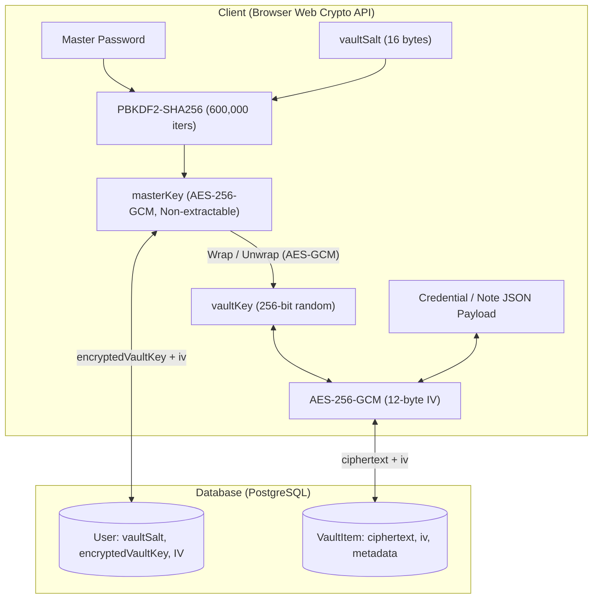
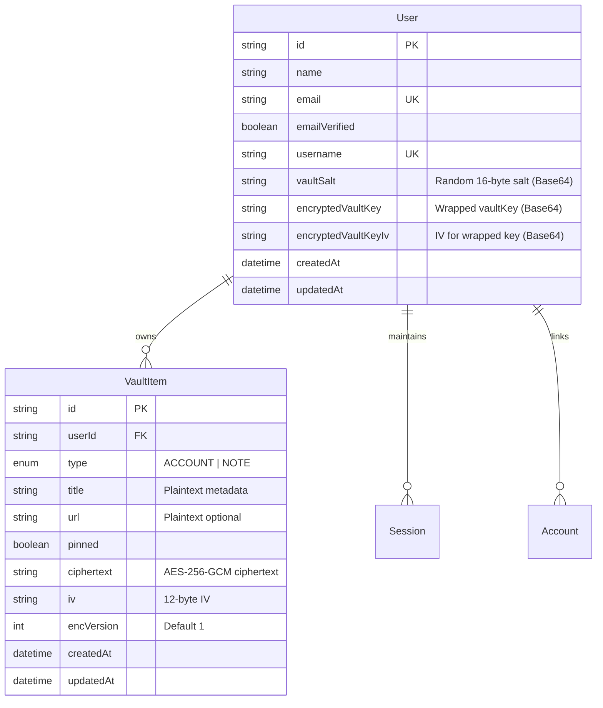

# 📄 Product Requirement Document (PRD): Centinela

**Document Version:** 1.4.0  
**Project:** Centinela  
**Classification:** Security / Password & Secrets Management  
**Status:** In Production / Active Development  
**Author:** Joko Santoso  
**Translations:** [Bahasa Indonesia](PRD.id.md)

---

## 1. Executive Summary

Centinela is a web-based, zero-knowledge password and secrets manager designed to protect sensitive user credentials and private notes. All sensitive data is encrypted on the client side before transmission, ensuring that the backend server and database only ever store ciphertext.

### Core Value Proposition

- **True Zero-Knowledge:** Even in the event of a total database leak or compromised server, user data cannot be decrypted without the user's Master Password.
- **Envelope Encryption:** Decouples user-derived keys from the vault encryption key, enabling seamless Master Password changes without re-encrypting vault items.
- **Flexible Identifiers:** Accommodates modern account formats (usernames, member numbers, account IDs, phone numbers) alongside traditional email/password pairs.

---

## 2. Threat Model & Security Invariants

### 2.1. Security Invariants

1. **Zero Plaintext on Wire/Disk:** Plaintext credentials and notes never leave the client browser unencrypted.
2. **Master Password Isolation:** The Master Password is never transmitted, hashed on server, or stored anywhere.
3. **In-Memory Lifetime:** Cryptographic keys (`masterKey`, `vaultKey`) reside strictly in volatile browser RAM and are purged upon page reload, lock, or sign-out.
4. **Tamper Proofing:** Ciphertext authenticity and integrity are enforced via AES-256-GCM authentication tags.

### 2.2. Threat Matrix

| Threat Scenario                   | Risk Level | Mitigation Strategy                                                                                              |
| :-------------------------------- | :--------- | :--------------------------------------------------------------------------------------------------------------- |
| **Database Compromise**           | Critical   | Attacker acquires only AES-GCM ciphertext, random IVs, and PBKDF2 salts. Data remains mathematically unreadable. |
| **Malicious Server / Insider**    | High       | Server has no cryptographic access to decrypt payloads without the client-held Master Password.                  |
| **Man-in-the-Middle (MITM)**      | Medium     | Data is encrypted end-to-end client-side before transport over HTTPS.                                            |
| **Brute-Force Dictionary Attack** | High       | PBKDF2-SHA256 with 600,000 iterations dramatically increases computational cost per guess.                       |
| **XSS Key Extraction**            | High       | Keys are marked `extractable: false` in Web Crypto where applicable and never written to web storage.            |

---

## 3. Cryptographic Architecture



### Cryptographic Parameters

| Component          | Specification                                   | Standard / Reference               |
| :----------------- | :---------------------------------------------- | :--------------------------------- |
| **API Provider**   | W3C Web Crypto API (`window.crypto.subtle`)     | Standard Browser Engine Native C++ |
| **Key Derivation** | PBKDF2 with HMAC-SHA256                         | OWASP Password Storage Guidelines  |
| **Iterations**     | 600,000 rounds                                  | OWASP Recommended Minimum (2023+)  |
| **Master Key**     | AES-GCM 256-bit (`extractable: false`)          | Key-wrapping key                   |
| **Vault Key**      | AES-GCM 256-bit random                          | Payload encryption key             |
| **IV Generation**  | 12 bytes (96 bits) via `crypto.getRandomValues` | Unique per encryption operation    |
| **Payload Format** | Base64-encoded strings                          | Network and database serialization |

---

## 4. End-to-End System & Cryptographic Flows

### 4.1. Authentication & Account Lifecycle Flows

#### A. Registration & Account Initialization Flow

1. **User Input:** User submits Full Name, Email, Username (with real-time slugification and debounced availability verification), and Account Password (with built-in generator modal).
2. **Database Hook (`beforeCreate`):** The server automatically generates a unique 16-byte cryptographically random `vaultSalt` (`crypto.getRandomValues(new Uint8Array(16))`), encoded in Base64 and stored in the user record.
3. **Verification Dispatch:** Better Auth creates a signed stateless JWT token (1-hour validity) and dispatches an activation email via Resend SMTP.
4. **Client Anti-Spam / Rate Limiting:** The dispatch timestamp (`Date.now()`) is recorded in `localStorage` under `verify_email_cooldown_${email.toLowerCase()}`. The user is redirected to `/verify-email?email=...`.

#### B. Email Verification Flow (`/verify-email`)

1. **Server-Side Validation:**
   - If user is already verified: redirected to `/login?verified=true`.
   - If user does not exist or email format is invalid: redirected to `/login`.
2. **Cooldown Synchronization (`useSyncExternalStore`):**
   - The client form synchronizes with `localStorage` and a 1-second interval ticker without causing React cascading renders or hydration mismatches.
   - The resend button is disabled with an active countdown (`Resend email in 59s...`).
   - **Anti-Bypass / Anti-Refresh:** Page reloads (F5), tab duplication, and browser restarts preserve the remaining countdown.
   - When the timer reaches zero, the key is removed from storage and the button becomes active (`Resend verification email`).
3. **Verification Completion:** Clicking the link in the email marks `emailVerified: true` in the database. Subsequent clicks safely redirect to `/vault` or `/login`.

#### C. Sign-In Flow (`/login`)

1. **Identifier Handling:** Users can sign in using either their **Email** or **Username**.
2. **Verification Guard:** Unverified accounts are rejected with an explicit prompt to verify their email address.
3. **Success State:** Session cookies are established, and the user is redirected to `/vault`.

#### D. Account Password Reset Flow (`/forgot-password` & `/reset-password`)

1. **Reset Request:** User submits email on `/forgot-password`. Better Auth generates a 15-minute token and emails a reset link.
2. **Reset Execution:** User submits a new password on `/reset-password?token=...`.
   - Better Auth updates the account password hash and revokes all active sessions (`revokeSessionsOnPasswordReset: true`).
   - The client triggers `toast.success` and immediately performs `router.replace('/login')`, preventing the expired token page from remaining in browser navigation history.

---

### 4.2. Zero-Knowledge Master Key & Vault Lifecycle

#### A. Initial Master Password Setup (`/setup-vault`)

_Executed on the first login when `encryptedVaultKey` is null._

1. User defines a strong Master Password, guided by a 5-tier visual strength meter (Weak, Fair, Good, Strong, Very Strong) and an integrated password generator.
2. **Client-Side Key Generation (Web Crypto API):**
   - **Derive Master Key:** `masterPassword` + `vaultSalt` is derived via `PBKDF2-HMAC-SHA256` (600,000 rounds) into `masterKey` (AES-256-GCM, `extractable: false`).
   - **Generate Vault Key:** A random 256-bit AES-GCM `vaultKey` is generated (`crypto.subtle.generateKey`).
   - **Key Wrapping:** `vaultKey` is wrapped using `masterKey` with a unique 12-byte IV (`crypto.subtle.wrapKey`).
3. **Persistence:** Wrapped key and IV are Base64-encoded and transmitted via Server Action `saveEncryptedVaultKey` to PostgreSQL. `vaultKey` is stored in the in-memory React Context (`VaultKeyProvider`). User is redirected to `/vault`.

#### B. Vault Unlock Flow (`/vault`)

_Executed on subsequent logins, new sessions, or page reloads where in-memory keys are cleared._

1. `VaultClient` detects `isUnlocked === false` (`vaultKey === null`).
2. The UI renders the **Unlock Vault** dialog, requesting the Master Password.
3. **Client-Side Key Recovery:**
   - Derives `masterKey` from input password + `user.vaultSalt`.
   - Attempts `unwrapKey` on `encryptedVaultKey` with `encryptedVaultKeyIv`.
   - **Authentication Guarantee:** If Master Password is incorrect, Web Crypto rejects decryption and displays "Incorrect master password".
   - If valid, `vaultKey` is stored in memory (`isUnlocked = true`), and the vault items are decrypted.

#### C. Master Password Rotation (Rewrap Flow)

_Executed in `/settings` when user updates their Master Password._

1. User provides current and new Master Password (with strength indicator).
2. **Zero Re-encryption of Vault Items:**
   - Active in-memory `vaultKey` is retained.
   - A new `newMasterKey` is derived from the new password + `vaultSalt`.
   - `rewrapVaultKey(vaultKey, newMasterKey)` wraps the existing `vaultKey` under the new master key.
   - Updated `encryptedVaultKey` and IV are persisted to database.
   - **Multi-Device Session Eviction:** In a single atomic `prisma.$transaction`, the server updates the key and evicts all other active sessions across other devices (`id: { not: currentSessionId }`).
   - **Result:** All existing items in the vault remain valid and completely untouched.

#### D. Emergency Master Password Reset

1. If Master Password is forgotten, recovery is mathematically impossible under Zero-Knowledge principles.
2. User accepts an explicit, irreversible acknowledgment via confirmation checkbox in an alert dialog.
3. Server Action `resetMasterPassword` atomically wipes all vault items (`prisma.vaultItem.deleteMany`), nullifies `encryptedVaultKey` / IV, purges all other sessions in a single `prisma.$transaction`, and redirects to `/setup-vault`.

---

### 4.3. In-Depth Data Encryption & Decryption Pipeline

#### A. Data Encryption Pipeline (Write / Create / Update)

```
Form Input (Account / Note)
   │
   ▼ [Step 1: Payload Construction]
Data Object { email, username, phone, password, pin, notes, credentialHistory }
   │
   ▼ [Step 2: JSON Serialization]
JSON String
   │
   ▼ [Step 3: Byte Encoding]
Uint8Array Buffer (via TextEncoder)
   │
   ├───────────────────────────────┐
   ▼                               ▼
[Vault Key (AES-256)]     [Random 12-byte IV (crypto.getRandomValues)]
   │                               │
   └───────────────┬───────────────┘
                   ▼ [Step 4: AES-256-GCM Encryption]
           crypto.subtle.encrypt(AES-GCM, iv, vaultKey, dataBuffer)
                   │
                   ▼ [Step 5: Base64 Encoding]
           Ciphertext (Base64) + IV (Base64)
                   │
                   ▼ [Step 6: Server Action Dispatch]
Persisted to PostgreSQL (`VaultItem` table)
```

1. **Payload Isolation:** Only non-sensitive routing metadata (`title`, `url`, `type`, `pinned`) is stored unencrypted for indexing and search. All credentials, identifiers, and notes are packed into `data`.
2. **Credential History Preservation:** If an existing account's password or PIN is modified with the history toggle enabled, previous credentials are prepended to `credentialHistory` (FIFO capped at 10) before encryption.
3. **IV Freshness:** A new 12-byte IV is generated for every single save/update operation, preventing ciphertext replay and pattern analysis.
4. **Integrity Enforcement:** AES-GCM embeds a 128-bit authentication tag into the ciphertext buffer.

#### B. Data Decryption Pipeline (Read / Fetch / Display)

```
PostgreSQL Database
   │
   ▼ [Step 1: Server Component Fetch]
VaultItem Records: { id, title, url, type, pinned, ciphertext, iv }
   │
   ▼ [Step 2: Client Hydration & Memory Check]
Verify isUnlocked === true && vaultKey !== null
   │
   ├───────────────────────────────┐
   ▼                               ▼
Ciphertext (Base64)             IV (Base64)
   │                               │
   ▼ [Step 3: Base64 to ArrayBuffer]
Ciphertext Buffer               IV Buffer (12 bytes)
   │                               │
   └───────────────┬───────────────┘
                   │
                   ▼ [Step 4: AES-256-GCM Decryption]
crypto.subtle.decrypt(AES-GCM, ivBuffer, vaultKey, ciphertextBuffer)
                   │
                   ▼ [Step 5: String Decoding]
UTF-8 Plaintext String (via TextDecoder)
                   │
                   ▼ [Step 6: JSON Deserialization]
Original Typed Object (`AccountData` | `NoteData`)
                   │
                   ▼ [Step 7: Memory Rendering]
Rendered in React State (`decryptedItems`)
```

1. **Fail-Closed Protection:** If the ciphertext or IV has been tampered with or corrupted, `crypto.subtle.decrypt` throws an unrecoverable DOMException. The item is rejected immediately.
2. **Zero Storage Footprint:** Plaintext values only exist in volatile React component state and are never written to disk, indexedDB, or browser storage.

---

### 4.4. Vault Item Operations & State Management

1. **Optimistic Updates:** Toggling item pins executes via React `useOptimistic` for instantaneous UI reaction while `toggleVaultItemPin` runs asynchronously in the background.
2. **Client-Side Filtering & Search:** Vault searches query decrypted in-memory items (by title, email, username, or note content) without leaking queries to backend server logs.
3. **Form Dirty State & Change Detection:** Uses deep equality (`lodash.isequal`) combined with history modification state (`isHistoryChanged`) to ensure the Save button only activates when real changes occur.
4. **Memory Purge on Lock/Sign-Out:** Calling `lock()` sets `vaultKey = null`, immediately removing sensitive items from active component trees.

---

### 4.5. Account Settings & Security Flows

1. **Basic Information Management (`BasicInformationForm`):** Allows users to update Full Name and Username with real-time uniqueness validation (1–12 characters, regex `/^[a-z0-9_]+$/`) and session refetch.
2. **Account Password Change:** Updates authentication credentials via Better Auth `changePassword` without altering cryptographic vault keys.
3. **Account Email Change:** Requires email verification on the new address; sends security alerts to the previous email and invalidates all other active sessions upon completion.
4. **Account Deletion & Goodbye Security:** Cascades deletion across `vaultItem`, `user`, and `session` tables, sets an HTTP-only temporary `goodbye_token` cookie (30-second TTL), and redirects to the protected `/goodbye` page.

---

## 5. Functional Requirements

### 5.1. Authentication & Profile Management (Better Auth)

- **FR-AUTH-1:** Account registration with Name, Email, Username, and Password.
- **FR-AUTH-2:** Automatic generation of a 16-byte cryptographically random `vaultSalt` on user creation.
- **FR-AUTH-3:** Mandatory email verification via Resend before vault activation with anti-refresh 60-second cooldown timer.
- **FR-AUTH-4:** Dual identifier login support (Email or Username).
- **FR-AUTH-5:** Account password reset (independent of Master Password) with session invalidation and instant login redirect.
- **FR-AUTH-6:** User profile management allowing Full Name and Username updates with real-time availability checks and dirty-state tracking.

### 5.2. Master Password & Vault Lifecycle

- **FR-VAULT-1 (Setup):** Prompt user to establish a Master Password post-verification, initializing wrapped `vaultKey`.
- **FR-VAULT-2 (Unlock):** On application visit, user enters Master Password to unwrap `vaultKey` into active memory.
- **FR-VAULT-3 (Lock):** Manual lock button or automatic flush upon page reload.
- **FR-VAULT-4 (Rewrap):** Changing Master Password unwraps existing `vaultKey` and re-wraps it with the new key without touching vault items.
- **FR-VAULT-5 (Emergency Reset):** If Master Password is lost, user can purge all vault items and reset Master Password state.
- **FR-VAULT-6 (Strength Meter):** 5-level real-time visual password strength meter with color progression (Weak to Very Strong) for Master Password creation and update.
- **FR-VAULT-7 (Atomic Session Eviction):** Master Password rotation and reset operations evict all other sessions atomically in a single database transaction.

### 5.3. Vault Item Management

- **FR-ITEM-1 (Item Types):**
  - `ACCOUNT`: Title, URL, Identifiers (Email, **Username / ID**, Phone), optional Credentials (Password, PIN), and Notes. At least one identifier is required; password/PIN are optional.
  - `NOTE`: Title, URL, Content (up to 10,000 characters).
- **FR-ITEM-2 (Payload Isolation):**
  - _Plaintext Metadata:_ `title`, `url`, `type`, `pinned`, timestamps.
  - _Encrypted Payload:_ All credentials, identifiers, notes, and history combined into JSON ciphertext.
- **FR-ITEM-3 (Credential History Management):**
  - Automatically records replaced passwords/PINs (capped at 10 entries).
  - Dynamic opt-out checkbox (`Save replaced credentials to history`) to avoid storing accidental typos.
  - In-form history deletion: individual entry deletion and `Clear all` button.
  - Value reveal toggling for past credentials.
- **FR-ITEM-4 (Operations):** Create, update, delete, search (client-side query), and category filtering (`ALL`, `ACCOUNT`, `NOTE`).
- **FR-ITEM-5 (Clipboard):** Secure copy to clipboard with toast confirmation.

### 5.4. Password Generator

- **FR-GEN-1:** Secure random generation using `window.crypto.getRandomValues`.
- **FR-GEN-2:** Customizable length (8–64 chars) and character sets (uppercase, lowercase, numbers, symbols).
- **FR-GEN-3:** Option to exclude ambiguous characters (`1`, `l`, `I`, `0`, `O`).
- **FR-GEN-4 (Universal Integration):** One-click generation and modal insertion available in Registration, Master Password Setup, Vault Forms, and Settings.

### 5.5. Database Maintenance

- **FR-MAINT-1:** Automated GitHub Actions cron every 3 days (`0 3 */3 * *`) to keep Supabase free-tier database active.
- **FR-MAINT-2:** Protected API route `/api/cron/keep-alive` with `CRON_SECRET` authentication.

### 5.6. User Interface & Privacy Protections

- **FR-UI-1 (Theme Switching):** System, Light, and Dark theme support via `next-themes` with immediate persistence.
- **FR-UI-2 (Sign-Out Privacy Overlay):** Full-screen privacy overlay triggered during sign-out to prevent visual flashing of decrypted secrets during route transitions.
- **FR-UI-3 (Protected Goodbye Route):** Access to `/goodbye` requires a short-lived HTTP-only `goodbye_token` cookie.

---

## 6. Data Model (Prisma Schema)



---

## 7. Server Actions Contract

All mutations adhere to a strict discriminated union response structure:

```typescript
export type ActionResponse<T = void> =
  | { success: true; data: T; error?: never }
  | (T extends void ? { success: true; error?: never } : never)
  | { success: false; error: string; data?: never };
```

| Action                     | Path                                | Purpose                                                        |
| :------------------------- | :---------------------------------- | :------------------------------------------------------------- |
| `saveEncryptedVaultKey`    | `src/actions/setup-vault.action.ts` | Stores initial wrapped vault key                               |
| `createEncryptedVaultItem` | `src/actions/vault.action.ts`       | Persists new encrypted item                                    |
| `updateEncryptedVaultItem` | `src/actions/vault.action.ts`       | Updates existing encrypted item                                |
| `deleteVaultItem`          | `src/actions/vault.action.ts`       | Deletes vault item by ID                                       |
| `toggleVaultItemPin`       | `src/actions/vault.action.ts`       | Toggles pinned status                                          |
| `updateMasterPassword`     | `src/actions/settings.action.ts`    | Persists re-wrapped vault key & evicts other sessions (atomic) |
| `resetMasterPassword`      | `src/actions/settings.action.ts`    | Wipes vault items, resets key state & evicts sessions (atomic) |

---

## 8. Quality Assurance & Testing

Automated testing is powered by **Vitest**:

1. **Cryptographic Engine (`src/test/vault-crypto.test.ts`):**
   - PBKDF2 key derivation consistency.
   - Symmetric encryption/decryption validation.
   - Master Password rewrapping integrity.
   - Tamper detection and authentication tag verification.
2. **Schema & Validation (`src/test/vault-schema.test.ts`):**
   - Account identifier requirements (at least one of: email, username/ID, phone).
   - Optional credential rules.
   - Note character boundaries (1 to 10,000 characters).
3. **Server Actions (`src/test/vault-actions.test.ts`):**
   - Session authorization checks.
   - Input payload validation.
   - Transactional integrity.

---

## 9. Product Roadmap

- **Phase 1 (Completed):** Zero-Knowledge Core, Envelope Encryption, In-Depth Flow Architecture, Vault CRUD, Password Generator, Credential History Management, Supabase Keep-Alive, Theme Support, Profile Updates.
- **Phase 2 (Upcoming):** Two-Factor Authentication (TOTP 2FA), Biometric / WebAuthn unlock.
- **Phase 3 (Future):** Browser Extension (autofill/autosave), Encrypted file attachments, Vault import/export (Bitwarden, 1Password CSV).
