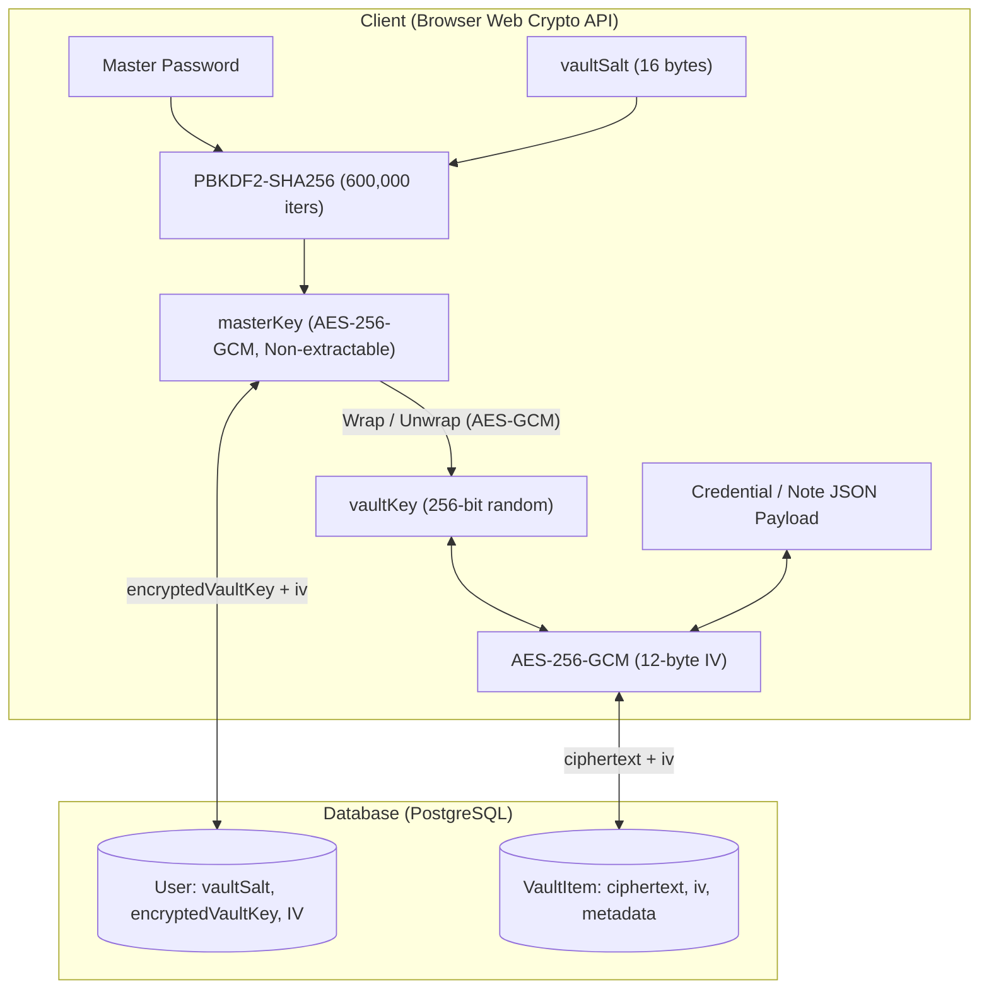
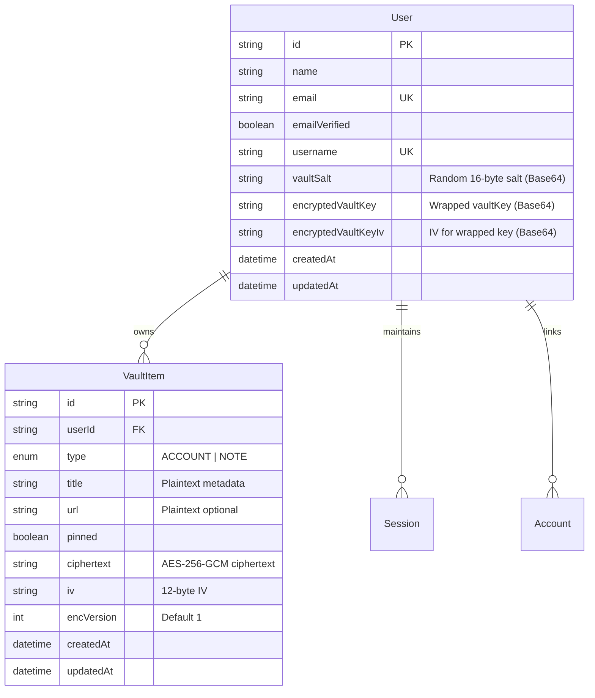

# 📄 Product Requirement Document (PRD): Centinela

**Document Version:** 1.2.0  
**Project:** Centinela  
**Classification:** Security / Password & Secrets Management  
**Status:** In Production / Active Development  
**Author:** Joko Santoso

---

## 1. Executive Summary

Centinela is a web-based, zero-knowledge password and secrets manager designed to protect sensitive user credentials and private notes. All sensitive data is encrypted on the client side before transmission, ensuring that the backend server and database only ever store ciphertext.

### Core Value Proposition

- **True Zero-Knowledge:** Even in the event of a total database leak or compromised server, user data cannot be decrypted without the user's Master Password.
- **Envelope Encryption:** Decouples user-derived keys from the vault encryption key, enabling seamless Master Password changes without re-encrypting vault items.
- **Flexible Identifiers:** Accommodates modern account formats (usernames, member numbers, account IDs) alongside traditional email/password pairs.

---

## 2. Threat Model & Security Invariants

### 2.1. Security Invariants

1. **Zero Plaintext on Wire/Disk:** Plaintext credentials and notes never leave the client browser unencrypted.
2. **Master Password Isolation:** The Master Password is never transmitted, hashed on server, or stored.
3. **In-Memory Lifetime:** Keys (`masterKey`, `vaultKey`) reside strictly in browser RAM and are purged upon page refresh or explicit lock.
4. **Tamper Proofing:** Ciphertext integrity is enforced via AES-256-GCM authentication tags.

### 2.2. Threat Matrix

| Threat Scenario                   | Risk Level | Mitigation Strategy                                                                                              |
| :-------------------------------- | :--------- | :--------------------------------------------------------------------------------------------------------------- |
| **Database Compromise**           | Critical   | Attacker acquires only AES-GCM ciphertext, random IVs, and PBKDF2 salts. Data remains mathematically unreadable. |
| **Malicious Server / Insider**    | High       | Server has no cryptographic access to decrypt payloads without the Master Password.                              |
| **Man-in-the-Middle (MITM)**      | Medium     | Data is encrypted end-to-end client-side before transport over HTTPS.                                            |
| **Brute-Force Dictionary Attack** | High       | PBKDF2-SHA256 with 600,000 iterations dramatically increases computational cost per guess.                       |
| **XSS Key Extraction**            | High       | Keys are marked `extractable: false` in Web Crypto and never written to `localStorage` or `sessionStorage`.      |

---

## 3. Cryptographic Architecture



### Cryptographic Parameters

| Component          | Specification                                   | Standard / Reference               |
| :----------------- | :---------------------------------------------- | :--------------------------------- |
| **API Provider**   | W3C Web Crypto API (`window.crypto.subtle`)     | Standard Browser Engine            |
| **Key Derivation** | PBKDF2 with HMAC-SHA256                         | OWASP Password Storage Guidelines  |
| **Iterations**     | 600,000 rounds                                  | OWASP Recommended Minimum          |
| **Master Key**     | AES-GCM 256-bit (`extractable: false`)          | Key-wrapping key                   |
| **Vault Key**      | AES-GCM 256-bit random                          | Payload encryption key             |
| **IV Generation**  | 12 bytes (96 bits) via `crypto.getRandomValues` | Unique per encryption              |
| **Payload Format** | Base64-encoded strings                          | Network and database serialization |

---

## 4. Functional Requirements

### 4.1. Authentication (Better Auth)

- **FR-AUTH-1:** Account registration with Name, Email, Username, and Password.
- **FR-AUTH-2:** Automatic generation of a 16-byte cryptographically random `vaultSalt` on user creation.
- **FR-AUTH-3:** Mandatory email verification via Resend before vault activation.
- **FR-AUTH-4:** Dual identifier login support (Email or Username).
- **FR-AUTH-5:** Account password reset (independent of Master Password).

### 4.2. Master Password & Vault Lifecycle

- **FR-VAULT-1 (Setup):** Prompt user to establish a Master Password post-verification, initializing wrapped `vaultKey`.
- **FR-VAULT-2 (Unlock):** On application visit, user enters Master Password to unwrap `vaultKey` into active memory.
- **FR-VAULT-3 (Lock):** Manual lock button or automatic flush upon page reload.
- **FR-VAULT-4 (Rewrap):** Changing Master Password unwraps existing `vaultKey` and re-wraps it with the new key without touching vault items.
- **FR-VAULT-5 (Emergency Reset):** If Master Password is lost, user can purge all vault items and reset Master Password state.

### 4.3. Vault Item Management

- **FR-ITEM-1 (Item Types):**
  - `ACCOUNT`: Title, URL, Identifiers (Email, **Username / ID**, Phone), optional Credentials (Password, PIN), and Notes.
  - `NOTE`: Title, URL, Content (up to 10,000 characters).
- **FR-ITEM-2 (Payload Isolation):**
  - _Plaintext Metadata:_ `title`, `url`, `type`, `pinned`, timestamps.
  - _Encrypted Payload:_ All credentials, identifiers, notes, and history combined into JSON ciphertext.
- **FR-ITEM-3 (Credential History Management):**
  - Automatically records replaced passwords/PINs (capped at 10 entries).
  - Dynamic opt-out checkbox (`Save replaced credentials to history`) to avoid storing accidental typos.
  - In-form history deletion: individual entry deletion and `Clear all` button.
- **FR-ITEM-4 (Operations):** Create, update, delete, search (client-side query), and category filtering (`ALL`, `ACCOUNT`, `NOTE`).
- **FR-ITEM-5 (Clipboard):** Secure copy to clipboard with toast confirmation.

### 4.4. Password Generator

- **FR-GEN-1:** Secure random generation using `window.crypto.getRandomValues`.
- **FR-GEN-2:** Customizable length (8–64 chars) and character sets (uppercase, lowercase, numbers, symbols).
- **FR-GEN-3:** Option to exclude ambiguous characters (`1`, `l`, `I`, `0`, `O`).
- **FR-GEN-4:** Quick insertion into registration, setup, and vault forms.

### 4.5. Database Maintenance

- **FR-MAINT-1:** Automated GitHub Actions cron every 3 days (`0 3 */3 * *`) to keep Supabase free-tier database active.
- **FR-MAINT-2:** Protected API route `/api/cron/keep-alive` with `CRON_SECRET` authentication.

---

## 5. Data Model (Prisma Schema)



---

## 6. Server Actions Contract

All mutations adhere to a strict discriminated union response structure:

```typescript
export type ActionResponse<T = void> =
  | { success: true; data: T; error?: never }
  | (T extends void ? { success: true; error?: never } : never)
  | { success: false; error: string; data?: never };
```

| Action                     | Path                                | Purpose                                |
| :------------------------- | :---------------------------------- | :------------------------------------- |
| `saveEncryptedVaultKey`    | `src/actions/setup-vault.action.ts` | Stores initial wrapped vault key       |
| `createEncryptedVaultItem` | `src/actions/vault.action.ts`       | Persists new encrypted item            |
| `updateEncryptedVaultItem` | `src/actions/vault.action.ts`       | Updates existing encrypted item        |
| `deleteVaultItem`          | `src/actions/vault.action.ts`       | Deletes vault item by ID               |
| `toggleVaultItemPin`       | `src/actions/vault.action.ts`       | Toggles pinned status                  |
| `updateMasterPassword`     | `src/actions/settings.action.ts`    | Persists re-wrapped vault key          |
| `resetMasterPassword`      | `src/actions/settings.action.ts`    | Wipes vault items and resets key state |

---

## 7. Quality Assurance & Testing

Automated testing is powered by **Vitest**:

1. **Cryptographic Engine (`src/test/vault-crypto.test.ts`):**
   - PBKDF2 key derivation consistency.
   - Symmetric encryption/decryption validation.
   - Master Password rewrapping integrity.
   - Tamper detection and authentication tag verification.
2. **Schema & Validation (`src/test/vault-schema.test.ts`):**
   - Account identifier requirements (at least one of: email, username/ID, phone).
   - Optional credential rules.
   - Note character boundaries (1 to 10,000 characters).
3. **Server Actions (`src/test/vault-actions.test.ts`):**
   - Session authorization checks.
   - Input payload validation.
   - Transactional integrity.

---

## 8. Product Roadmap

- **Phase 1 (Completed):** Zero-Knowledge Core, Envelope Encryption, Vault CRUD, Password Generator, Credential History Management, Supabase Keep-Alive.
- **Phase 2 (Upcoming):** Two-Factor Authentication (TOTP 2FA), Biometric / WebAuthn unlock.
- **Phase 3 (Future):** Browser Extension (autofill/autosave), Encrypted file attachments, Vault import/export (Bitwarden, 1Password CSV).
