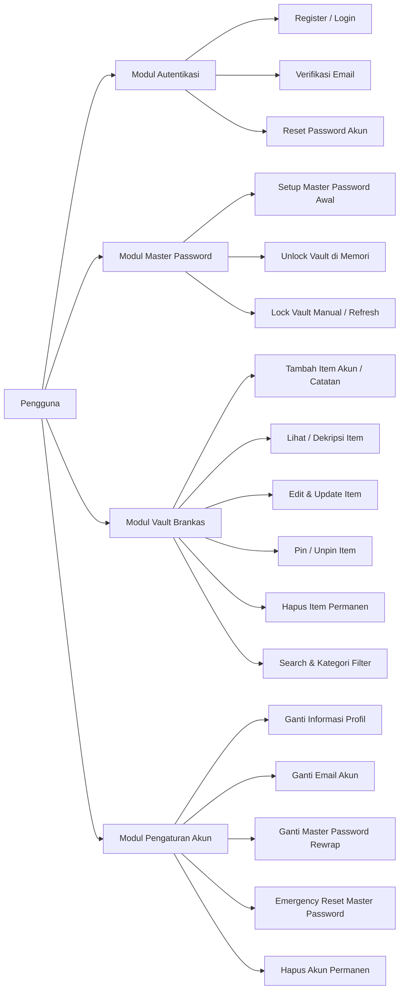
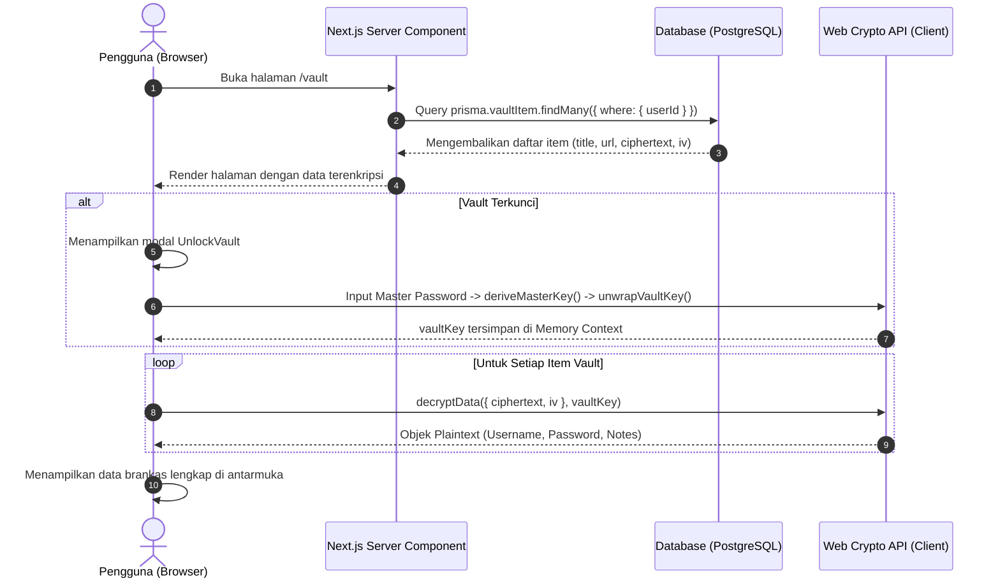
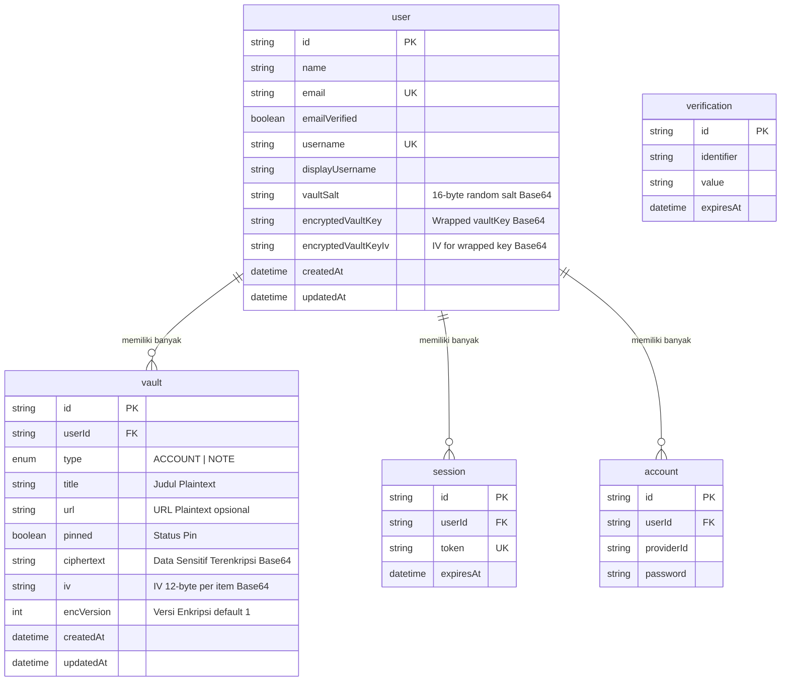

# 📄 Product Requirement Document (PRD): Centinela

**Document Version:** 1.0.0  
**Project Name:** Centinela  
**Classification:** Security / Password Management  
**Status:** In Production / Active Development  
**Author:** Centinela Engineering Team  
**Last Updated:** September 2026

---

## 📑 Daftar Isi

1. [Ringkasan Eksekutif & Visi Produk](#1-ringkasan-eksekutif--visi-produk)
2. [Prinsip Zero-Knowledge & Model Ancaman](#2-prinsip-zero-knowledge--model-ancaman)
3. [Target Pengguna & Persona](#3-target-pengguna--persona)
4. [Kebutuhan Fungsional (Functional Requirements)](#4-kebutuhan-fungsional-functional-requirements)
5. [Spesifikasi Teknis & Kriptografi](#5-spesifikasi-teknis--kriptografi)
6. [Arsitektur Sistem & Alur Data](#6-arsitektur-sistem--alur-data)
7. [Skema Database (Data Modeling)](#7-skema-database-data-modeling)
8. [Spesifikasi Server Actions & Kontrak Data](#8-spesifikasi-server-actions--kontrak-data)
9. [Kebutuhan Non-Fungsional (Non-Functional Requirements)](#9-kebutuhan-non-fungsional-non-functional-requirements)
10. [Strategi Pengujian & QA](#10-strategi-pengujian--qa)
11. [Roadmap & Rencana Pengembangan Mendatang](#11-roadmap--rencana-pengembangan-mendatang)

---

## 1. Ringkasan Eksekutif & Visi Produk

### 1.1. Latar Belakang

Di era maraknya kebocoran data (_data breaches_), menyimpan kata sandi dan catatan rahasia di server cloud tradisional menimbulkan risiko besar. Jika database server bocor, data sensitif pengguna berpotensi terekspos.

### 1.2. Solusi: Centinela

**Centinela** (_bahasa Spanyol: penjaga / sentry_) adalah aplikasi pengelola kata sandi dan catatan rahasia berbasis web dengan prinsip **Zero-Knowledge** dan **Envelope Encryption**.

Semua data sensitif (username, password, nomor telepon, PIN, catatan rahasia) dienkripsi secara penuh di browser pengguna (client-side) menggunakan **Web Crypto API** sebelum dikirim ke server. Server hanya bertindak sebagai media sinkronisasi _ciphertext_ dan tidak memiliki kemampuan matematis untuk membaca data aslinya.

---

## 2. Prinsip Zero-Knowledge & Model Ancaman

### 2.1. Aturan Dasar Zero-Knowledge Centinela

1. **Master Password Tidak Pernah Menyentuh Jaringan:** Master Password pengguna tidak pernah dikirim, dicatat, atau disimpan di server.
2. **Kunci Asli Tidak Pernah Disimpan Plain:** Kunci enkripsi vault (`vaultKey`) hanya tersimpan di database dalam bentuk terbungkus (_wrapped_) oleh kunci turunan Master Password (`masterKey`).
3. **Kunci Hanya Hidup di Memori Sementara:** `masterKey` dan `vaultKey` hanya disimpan di RAM browser selama sesi aktif dan otomatis hilang saat halaman di-refresh atau tab ditutup.
4. **Deteksi Tampering Bawaan:** Menggunakan cipher **AES-256-GCM** yang memiliki _Authentication Tag_ bawaan untuk mendeteksi data yang dimanipulasi atau percobaan pembongkaran dengan Master Password yang salah.

### 2.2. Model Ancaman (Threat Model)

| Skenario Ancaman                   | Perlindungan Centinela                                                                                                  |
| :--------------------------------- | :---------------------------------------------------------------------------------------------------------------------- |
| **Database Server Bocor / Dumped** | Penyerang hanya mendapatkan _ciphertext_, _IV_, dan _salt_. Tanpa Master Password pengguna, data tidak bisa didekripsi. |
| **Developer / Admin Nakal**        | Pengembang aplikasi tidak memiliki kunci dekripsi dan tidak bisa membuka brankas pengguna.                              |
| **Man-in-the-Middle (MITM)**       | Data sudah dalam bentuk terenkripsi kuat sebelum meninggalkan browser via koneksi HTTPS.                                |
| **Brute Force Serangan Kamus**     | Derivasi kunci menggunakan PBKDF2-SHA256 dengan 600.000 iterasi memperlambat kalkulasi penyerang secara signifikan.     |

---

## 3. Target Pengguna & Persona

1. **Privacy-Conscious Individuals:** Pengguna yang membutuhkan tempat menyimpan kredensial akun dan informasi rahasia tanpa mempercayai pihak ketiga.
2. **Developers & Tech Workers:** Pengguna teknis yang ingin transparansi kriptografi terstandarisasi (Web Crypto API, AES-GCM, PBKDF2).
3. **General Users:** Pengguna umum yang membutuhkan UI modern, responsif, dan mudah digunakan untuk manajemen akun harian.

---

## 4. Kebutuhan Fungsional (Functional Requirements)



### 4.1. Modul Autentikasi (Better Auth)

- **FR-AUTH-1:** Registrasi dengan Nama, Email, Username, dan Password Akun.
- **FR-AUTH-2:** Hook database otomatis mengenerate `vaultSalt` (16 bytes acak, Base64) saat registrasi user baru.
- **FR-AUTH-3:** Verifikasi email wajib melalui tautan konfirmasi yang dikirimkan via email (Resend provider).
- **FR-AUTH-4:** Login dengan fleksibilitas menggunakan Email atau Username.
- **FR-AUTH-5:** Fitur _Forgot Password_ untuk password login akun (tidak merusak data vault).

### 4.2. Modul Master Password & Vault Lifecycle

- **FR-VAULT-1 (Setup Awal):** Setelah verifikasi akun, user diarahkan untuk membuat Master Password pertama kali.
- **FR-VAULT-2 (Key Wrapping):** Sistem client membuat `vaultKey` acak, melakukan enkripsi (_wrap_) dengan `masterKey`, dan mengirimkan `encryptedVaultKey` + `encryptedVaultKeyIv` ke server.
- **FR-VAULT-3 (Unlock):** Jika state `vaultKey` bernilai null di context, antarmuka brankas terkunci dan menampilkan modal unlock. User memasukkan Master Password untuk meng-unwrap `vaultKey`.
- **FR-VAULT-4 (Lock):** User dapat mengunci brankas kapan saja atau otomatis terkunci saat halaman di-refresh.

### 4.3. Modul Manajemen Item Vault

- **FR-ITEM-1 (Tipe Data):** Mendukung 2 tipe data utama:
  1. `ACCOUNT`: Title, URL, Email/Username/Phone, Password, PIN, Notes.
  2. `NOTE`: Title, URL, Content Teks Bebas (hingga 10.000 karakter).
- **FR-ITEM-2 (Metadata vs Sensitif):**
  - _Metadata Plaintext (di server):_ `title`, `url`, `type`, `pinned`, `encVersion`, `createdAt`, `updatedAt`.
  - _Payload Sensitif (Terenkripsi):_ Seluruh field kredensial dan isi catatan digabung menjadi JSON dan dienkripsi menjadi `ciphertext` + `iv`.
- **FR-ITEM-3 (CRUD):** Tambah item baru, update item yang ada, hapus item, dan toggle status pinned.
- **FR-ITEM-4 (Pencarian & Filter):** Pencarian instan client-side berdasarkan judul, email, atau username, serta filter kategori (`ALL`, `ACCOUNT`, `NOTE`).
- **FR-ITEM-5 (Clipboard Aman):** Salin field kredensial (username/password/PIN) langsung ke clipboard dengan konfirmasi toast.

### 4.4. Modul Pengaturan & Keamanan

- **FR-SET-1 (Ganti Master Password):** Pengguna dapat mengganti Master Password. Sistem meng-unwrap `vaultKey` dengan password lama, lalu me-rewrap `vaultKey` dengan Master Password baru tanpa perlu mengenkripsi ulang seluruh item vault.
- **FR-SET-2 (Reset Master Password):** Jika pengguna lupa Master Password, tersedia fitur reset darurat yang akan menghapus seluruh isi vault dan mereset status `encryptedVaultKey` ke null demi keamanan.
- **FR-SET-3 (Hapus Akun):** Penghapusan akun secara permanen beserta seluruh rekaman database terkait melalui konfirmasi email.

---

## 5. Spesifikasi Teknis & Kriptografi

```
+-------------------------------------------------------------------------+
|                          ARSITEKTUR ENKRIPSI                            |
+-------------------------------------------------------------------------+

 [User Master Password] + [vaultSalt (16 bytes)]
            │
            ▼  PBKDF2-SHA256 (600.000 iterasi)
      [masterKey] (AES-GCM 256-bit, Non-extractable)
            │
            ├─────────────── wrapKey (AES-GCM + IV 12 bytes) ─────────────┐
            │                                                             │
            ▼                                                             ▼
     [vaultKey (Acak 256-bit)]                              [encryptedVaultKey + IV]
            │                                                (Disimpan di DB User)
            │
            ▼  AES-GCM Enkripsi (IV acak 12 bytes per item)
   [Payload Akun / Catatan] ─────────► [ciphertext + iv]
                                        (Disimpan di DB VaultItem)
```

### 5.1. Parameter Kriptografi

| Komponen                       | Spesifikasi                                 | Keterangan                                               |
| :----------------------------- | :------------------------------------------ | :------------------------------------------------------- |
| **API Provider**               | W3C Web Crypto API (`window.crypto.subtle`) | Standard built-in browser engine                         |
| **Key Derivation**             | `PBKDF2`                                    | Hash: `SHA-256`, Salt: 16 bytes random Base64            |
| **PBKDF2 Iterasi**             | `600.000`                                   | Sesuai rekomendasi OWASP Password Storage Guidelines     |
| **Master Key Cipher**          | `AES-GCM` 256-bit                           | `extractable: false`, Usages: `['wrapKey', 'unwrapKey']` |
| **Vault Key Cipher**           | `AES-GCM` 256-bit                           | Usages: `['encrypt', 'decrypt']`                         |
| **Initialization Vector (IV)** | 12 bytes (96 bits) acak kriptografis        | Dibuat baru secara unik setiap kali enkripsi/wrapping    |
| **Format Serialisasi**         | Base64 Encoding                             | Digunakan untuk transmisi network dan penyimpanan DB     |

---

## 6. Arsitektur Sistem & Alur Data

### 6.1. Tech Stack

- **Framework:** Next.js 16 (App Router, Server Components & Server Actions)
- **UI & Styling:** React 19, Tailwind CSS v4, shadcn/ui, Radix UI Primitives, Lucide Icons
- **State Management:** React Context API (`VaultKeyProvider`) + In-Memory State
- **Form & Validation:** TanStack Form + Zod v4
- **Autentikasi:** Better Auth dengan Prisma Adapter & PostgreSQL
- **Database & ORM:** PostgreSQL + Prisma ORM (`@prisma/adapter-pg`)
- **Email Service:** Resend API
- **Testing Suite:** Vitest

### 6.2. Alur Pembacaan Data (Read Flow)



---

## 7. Skema Database (Data Modeling)



---

## 8. Spesifikasi Server Actions & Kontrak Data

Semua mutasi data server diatur melalui Server Actions dengan kontrak tipe **Discriminated Union** terstandarisasi:

```typescript
export type ActionResponse<T = void> =
  | { success: true; data: T; error?: never }
  | (T extends void ? { success: true; error?: never } : never)
  | { success: false; error: string; data?: never };
```

### 8.1. Ringkasan Endpoint Server Action

| Action Function            | File Sumber                            | Input Payload                            | Output Sukses                    |
| :------------------------- | :------------------------------------- | :--------------------------------------- | :------------------------------- |
| `saveEncryptedVaultKey`    | `src/app/(main)/setup-vault/action.ts` | `encryptedVaultKey, encryptedVaultKeyIv` | `ActionResponse`                 |
| `createEncryptedVaultItem` | `src/app/(main)/vault/action.ts`       | `EncryptedVaultItemInput`                | `ActionResponse<{ id: string }>` |
| `updateEncryptedVaultItem` | `src/app/(main)/vault/action.ts`       | `itemId, EncryptedVaultItemInput`        | `ActionResponse`                 |
| `deleteVaultItem`          | `src/app/(main)/vault/action.ts`       | `id`                                     | `ActionResponse`                 |
| `toggleVaultItemPin`       | `src/app/(main)/vault/action.ts`       | `id, pinned`                             | `ActionResponse`                 |
| `updateMasterPassword`     | `src/app/(main)/settings/action.ts`    | `encryptedVaultKey, encryptedVaultKeyIv` | `ActionResponse`                 |
| `resetMasterPassword`      | `src/app/(main)/settings/action.ts`    | `-`                                      | `ActionResponse`                 |

---

## 9. Kebutuhan Non-Fungsional (Non-Functional Requirements)

### 9.1. Keamanan & Privasi

- **Zero-Trust Server:** Server tidak memiliki akses ke plaintext data pengguna.
- **Strict Session Isolation:** Semua query database Server Actions memvalidasi `session.user.id` secara ketat untuk mencegah serangan _IDOR (Insecure Direct Object Reference)_.
- **Input Sanitization:** Validasi berlapis via Zod di sisi client (sebelum enkripsi) dan sisi server (sebelum query DB).

### 9.2. Performa

- **Optimistic UI Updates:** Toggle pin item dieksekusi secara instan di UI sebelum konfirmasi server selesai.
- **Client-Side Decryption Speed:** Dekripsi paralel seluruh item brankas via `Promise.all` memproses puluhan item dalam hitungan milidetik.
- **PBKDF2 Overhead:** Derivasi kunci berjalan di Web Worker / SubtleCrypto bawaan browser agar tidak memblokir render UI utama.

### 9.3. Keandalan & Integritas

- **Atomic Operations:** Operasi reset master password menggunakan Prisma `$transaction` untuk memastikan penghapusan item vault dan reset kunci user bersifat atomik.
- **No-Memory-Leak Keys:** Kunci kriptografi tidak pernah disimpan di `localStorage` atau `sessionStorage` untuk mencegah serangan XSS mengekstrak brankas.

---

## 10. Strategi Pengujian & QA

Centinela mengimplementasikan automated test suite menggunakan **Vitest**:

1. **Unit Test Kriptografi (`src/test/vault-crypto.test.ts`):**
   - Derivasi PBKDF2 Master Key.
   - Enkripsi dan dekripsi data Akun dan Catatan.
   - Pembungkusan ulang kunci (_rewrapping_) saat pergantian master password.
   - Verifikasi kegagalan dekripsi saat ciphertext dimanipulasi (_tamper resistance_).
2. **Unit Test Validasi Schema (`src/test/vault-schema.test.ts`):**
   - Integritas aturan form akun, format email, nomor telepon, dan PIN.
   - Batasan panjang karakter catatan dan Master Password.
3. **Unit Test Server Actions (`src/test/vault-actions.test.ts`):**
   - Mocking sesi autentikasi dan operasi Prisma ORM.
   - Verifikasi otorisasi, penolakan payload tidak valid, dan respons `ActionResponse`.

---

## 11. Roadmap & Rencana Pengembangan Mendatang

```mermaid
gantt
    title Roadmap Pengembangan Centinela
    dateFormat  YYYY-Q#
    section Fase 1 (Selesai)
    Core Zero-Knowledge Engine       :done, 2026-Q1, 2026-Q2
    Better Auth & Settings           :done, 2026-Q2, 2026-Q3
    Vault Management & Test Suite    :done, 2026-Q3, 2026-Q3
    section Fase 2 (Q4 2026)
    Two-Factor Authentication (2FA)  :active, 2026-Q4, 2026-Q4
    WebAuthn / Passkey Unlock        :2026-Q4, 2027-Q1
    Password Generator Generator UI  :2026-Q4, 2026-Q4
    section Fase 3 (2027)
    Browser Extension (Chrome/Edge)  :2027-Q1, 2027-Q2
    Secure File & Attachment Vault   :2027-Q2, 2027-Q3
    Argon2id Key Derivation Upgrade  :2027-Q3, 2027-Q4
```

- **Two-Factor Authentication (TOTP / Authenticator App):** Menambah lapisan keamanan kedua saat login akun.
- **Passkey / Biometric Unlock:** Memanfaatkan WebAuthn untuk membuka vault lokal via Fingerprint / Face ID tanpa harus mengetik Master Password berulang kali.
- **Built-in Password Generator:** Alat bantu pembuatan password acak berkekuatan tinggi di dalam modal form.
- **Browser Extension:** Ekstensi browser untuk fitur _Auto-fill_ dan _Auto-save_ kredensial langsung pada form website.
- **Export & Import Vault:** Fitur backup terenkripsi dan impor dari pengelola password lain (Bitwarden, 1Password, Chrome CSV).

---

_Dokumen ini merupakan spesifikasi resmi pengembangan produk Centinela. Setiap perubahan arsitektur atau kriptografi harus ditinjau dan diperbarui dalam dokumen ini._
