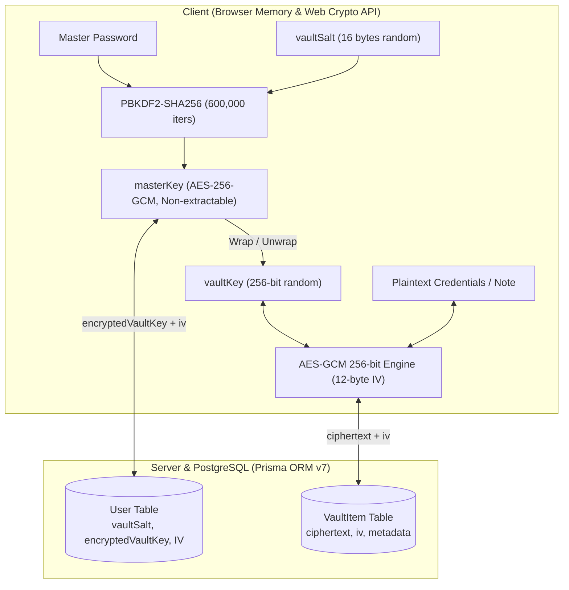

# 🔐 Centinela

**Centinela** is a modern zero-knowledge password and secret manager built with **Next.js 16**, **React 19**, and the **Web Crypto API**. All sensitive credentials and notes are encrypted and decrypted entirely client-side using **AES-256-GCM** before reaching the network or database. The server and PostgreSQL database only ever store ciphertext and initialization vectors (IVs) — never your plaintext credentials or Master Password.

---

## ✨ Features

- **Zero-Knowledge Encryption** — Client-side authenticated encryption using **AES-256-GCM**; the database and server never see plaintext credentials, PINs, or private notes.
- **Envelope Encryption (Key Wrapping)** — A dedicated 256-bit random `vaultKey` is wrapped by a PBKDF2-derived `masterKey` (600,000 iterations, OWASP recommended). Changing Master Passwords only requires re-wrapping the `vaultKey`, without needing to re-encrypt vault items.
- **Flexible Vault Items**:
  - **Account**: Supports multiple identifier types (Email, **Username / ID**, Phone Number), optional Password & PIN, and encrypted notes.
  - **Credential History**: Automatically archives past passwords and PINs with individual delete controls and an opt-out toggle to avoid saving accidental typos.
  - **Note**: Secure markdown/text notes up to 10,000 characters.
- **Route Security Proxy** — Next.js 16 edge proxy (`src/proxy.ts`) guarding `/vault`, `/settings`, and `/setup-vault` routes, instantly intercepting unauthenticated traffic.
- **Hardened HTTP Security Headers & CSP** — Strict Content Security Policy (CSP) with dynamic per-request nonces propagated to theme scripts, HSTS (`max-age=63072000; includeSubDomains; preload`), `X-Frame-Options: DENY`, `X-Content-Type-Options: nosniff`, `Referrer-Policy`, and `Permissions-Policy`.
- **Multi-Tier Distributed Rate Limiting** — Powered by [Upstash Redis](https://upstash.com/) with sliding-window counters and auto-pruning in-memory fallback, throttling authentication (`/sign-in/*`, `/sign-up/*`, `/change-password`), password reset (`/forget-password`, `/reset-password/*`), verification emails, and password verification.
- **Inactivity Auto-Lock & Cross-Tab Sync** — Vault automatically locks after 15 minutes of user inactivity and instantly synchronizes lock and reset events across all open browser tabs via `BroadcastChannel`.
- **Two-Step Email Change Security** — High-security email change flow requiring approval from the current email address before sending an activation link to the new address, with automated global session revocation.
- **Password Generator & Visual Strength Meter** — Cryptographically secure (`crypto.getRandomValues`) generator with configurable lengths, character sets, and ambiguous character filters, paired with a real-time 5-tier strength meter.
- **Fail-Closed & Re-Authentication Safeguards** — Destructive vault reset requires account password verification (`better-auth/crypto`); automated cron endpoints enforce fail-closed constant-time authentication (`crypto.timingSafeEqual`).
- **Resilient Decryption Pipeline** — Decryption runs via `Promise.allSettled`, isolating corrupted items so that accessible records remain decryptable and functional.
- **Clipboard Auto-Clearing** — Automatic 45-second timer purges copied credentials and PINs from the operating system clipboard.
- **Atomic Multi-Device Session Eviction** — Rotating or resetting the Master Password atomically invalidates all other active sessions across devices via `prisma.$transaction`.
- **Independent Account Authentication** — User account lifecycle managed by **Better Auth** with email verification enforced across all vault mutations via **Resend**.
- **In-Memory Key Lifetime** — Cryptographic keys reside exclusively in volatile browser RAM and are purged on page reload, lock, logout, or after 15 minutes of inactivity.
- **Database Keep-Alive & Automated Maintenance** — Scheduled keep-alive cron (`/api/cron/keep-alive`) and standalone script with strict SSL/TLS certificate validation (`rejectUnauthorized: true`, `SUPABASE_CA_CERT`) and automated database garbage collection for expired sessions and verifications.
- **UI & Privacy Polish** — Sign-out privacy overlay to prevent visual flashing of decrypted secrets during route transitions, protected goodbye page, and System/Light/Dark theme support via `next-themes`.

---

## 🏗️ Architecture



---

## 🧰 Tech Stack

| Layer                  | Technology                                                                                                                                                                  |
| :--------------------- | :-------------------------------------------------------------------------------------------------------------------------------------------------------------------------- |
| **Framework**          | [Next.js 16](https://nextjs.org/) (App Router, Server Actions, Edge Route Proxy)                                                                                            |
| **Frontend**           | [React 19](https://react.dev/), [Tailwind CSS v4](https://tailwindcss.com/), [shadcn/ui](https://ui.shadcn.com/), [next-themes](https://github.com/pacocoursey/next-themes) |
| **Cryptography**       | W3C Web Crypto API (`PBKDF2-HMAC-SHA256`, `AES-256-GCM`, `crypto.getRandomValues`)                                                                                          |
| **Database & ORM**     | PostgreSQL ([Supabase](https://supabase.com/)) + [Prisma ORM v7](https://www.prisma.io/)                                                                                    |
| **Authentication**     | [Better Auth](https://www.better-auth.com/) + [Resend](https://resend.com/) (Transactional Emails)                                                                          |
| **Rate Limiting**      | [Upstash Redis](https://upstash.com/) (`@upstash/ratelimit`, `@upstash/redis`) + In-Memory Fallback                                                                         |
| **Forms & Validation** | [TanStack Form](https://tanstack.com/form) + [Zod](https://zod.dev/)                                                                                                        |
| **Testing**            | [Vitest](https://vitest.dev/)                                                                                                                                               |

---

## 🚀 Getting Started

### 1. Prerequisites

- **Node.js** >= 20 (recommended: Node 24)
- PostgreSQL database (e.g. [Supabase](https://supabase.com/))
- [Resend](https://resend.com/) account for transactional verification emails
- [Upstash Redis](https://upstash.com/) account for distributed serverless rate limiting (optional; falls back to in-memory store)

### 2. Installation

```bash
git clone https://github.com/san64byte/centinela.git
cd centinela
npm install
cp .env.example .env
```

### 3. Environment Variables (`.env`)

```env
# Database URL
# Connect to Postgres via the shared transaction-mode pooler (IPv4-only)
DATABASE_URL=

# Connect to Postgres via the shared session-mode pooler (used for migrations)
DIRECT_URL=

# Resend Api Key
RESEND_API_KEY=

# Better Auth
BETTER_AUTH_SECRET=
BETTER_AUTH_URL=http://localhost:3000

# Cron Secret for /api/cron/keep-alive endpoint (Must be set in production)
CRON_SECRET=

# Optional: Supabase Root CA certificate (required if strict TLS verification requires CA bundle)
SUPABASE_CA_CERT=

# Upstash Redis (Distributed Rate Limiting di Serverless)
UPSTASH_REDIS_REST_URL=
UPSTASH_REDIS_REST_TOKEN=
```

### 4. Database Setup & Run

```bash
# Push migrations and generate Prisma client
npx prisma generate
npx prisma migrate dev

# Start development server
npm run dev
```

Open [http://localhost:3000](http://localhost:3000) in your browser.

---

## 🧪 Available Scripts

- `npm run dev` — Starts Next.js development server.
- `npm run build` — Lints code and builds production bundle.
- `npm run build:clean` — Cleans `.next` build cache and builds production bundle.
- `npm run start` — Starts production server.
- `npm run test` — Runs test suite with Vitest.
- `npm run test:watch` — Runs test suite in interactive watch mode.
- `npm run lint` — Runs ESLint checks.
- `npm run lint:fix` — Automatically fixes ESLint warnings and errors where possible.
- `npm run format` — Formats all files with Prettier.
- `npm run format:check` — Checks code formatting against Prettier rules.
- `npm run db:keep-alive` — Executes keep-alive ping query to Supabase with TLS certificate validation.

---

## 🔒 Security Principles

1. **True Zero Knowledge**: The server and database never receive plaintext credentials, notes, or the Master Password.
2. **Key Isolation**: Derivation keys (`masterKey`) never encrypt vault items directly; they only wrap the random `vaultKey`.
3. **OWASP Compliance**: Key derivation utilizes PBKDF2 with SHA-256 and 600,000 iterations.
4. **Authenticity Verification**: AES-256-GCM 128-bit authentication tags prevent tampering; any incorrect key or tampered ciphertext causes immediate decryption rejection.
5. **No Local Persistence**: Neither `masterKey` nor `vaultKey` is ever written to `localStorage`, `sessionStorage`, or `IndexedDB`.
6. **Ephemeral Memory & Clipboard Hygiene**: Sensitive keys reside strictly in memory, auto-lock after 15 minutes of inactivity (synced across tabs via `BroadcastChannel`), and purge on reload or logout. Copied secrets are automatically scrubbed from the system clipboard after 45 seconds.

---

## 📄 License

MIT License. Designed and built by [Joko Santoso](https://github.com/sanwxyz).
