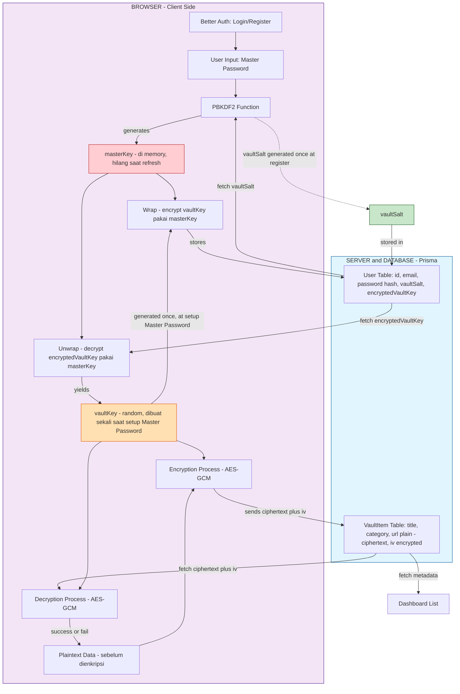

# 🔐 Centinela

**Centinela** adalah password manager **zero-knowledge** yang dibangun dengan Next.js. Nama "Centinela" (bahasa Spanyol: _penjaga/sentry_) mencerminkan fungsi utamanya — menjaga rahasia kamu tanpa pernah melihat isinya sendiri.

> **Zero-knowledge** berarti: server (dan siapa pun yang punya akses ke database) **tidak pernah** bisa melihat data asli kamu — username, password, catatan — karena semuanya dienkripsi di browser **sebelum** dikirim ke server. Bahkan developer aplikasi ini sendiri tidak bisa membukanya tanpa Master Password kamu.

---

## ✨ Fitur Utama

- 🔑 **End-to-end encryption** — data dienkripsi/didekripsi sepenuhnya di client (browser), menggunakan **AES-256-GCM**
- 🧂 **Key derivation aman** — Master Password diubah jadi kunci lewat **PBKDF2-SHA256** (600.000 iterasi, sesuai rekomendasi OWASP 2024+)
- 🗝️ **Dua lapis kunci (envelope encryption)** — `vaultKey` (kunci asli yang mengenkripsi vault item) dipisah dari `masterKey` (kunci turunan Master Password yang cuma membungkus `vaultKey`). Ganti Master Password tidak perlu membongkar ulang seluruh vault
- 🚫 **Master Password tidak pernah dikirim ke server** — hanya digunakan untuk derive key di browser
- 🧠 **Kunci hanya hidup di memory** — `masterKey` dan `vaultKey` otomatis hilang saat refresh halaman, memaksa re-derive dari Master Password
- 🔒 **Autentikasi terpisah** — login/register dikelola oleh [Better Auth](https://www.better-auth.com/), independen dari sistem enkripsi vault
- ✅ **Integritas data terjamin** — AES-GCM punya _authentication tag_ built-in, otomatis mendeteksi password salah atau data yang di-tamper

---

## 🏗️ Arsitektur



### Alur singkat

1. **Register** — User register lewat Better Auth → `vaultSalt` random di-generate sekali → disimpan di `User` table. Vault belum siap dipakai di titik ini.
2. **Setup Master Password** (step terpisah, setelah register) — User membuat Master Password → Master Password + `vaultSalt` di-derive lewat PBKDF2 jadi **`masterKey`** → `vaultKey` (kunci asli, random) di-generate sekali → `vaultKey` dienkripsi pakai `masterKey` → hasilnya (`encryptedVaultKey`) disimpan di `User` table.
3. **Unlock vault** — Setiap kali buka app / refresh, user input Master Password lagi → `vaultSalt` + `encryptedVaultKey` diambil dari server → `masterKey` di-derive ulang → dipakai untuk membuka `encryptedVaultKey` → didapat `vaultKey` yang sama seperti sebelumnya (server tidak pernah menyimpan `vaultKey` maupun `masterKey` dalam bentuk plain)
4. **Simpan item** — Data sensitif (username, password, notes) digabung jadi JSON → dienkripsi pakai `vaultKey` + AES-GCM → hanya `ciphertext` + `iv` yang dikirim & disimpan di server
5. **Buka item** — `ciphertext` + `iv` diambil dari server → didekripsi di client pakai `vaultKey` → jika Master Password salah, `masterKey` yang di-derive juga salah, `encryptedVaultKey` gagal dibuka, dan dekripsi vault item otomatis gagal (authentication tag mismatch)
6. **Ganti Master Password** — `masterKey` lama buka `encryptedVaultKey` → dapat `vaultKey` asli → `masterKey` baru (dari Master Password baru + `vaultSalt` yang sama) membungkus ulang `vaultKey` yang sama → `encryptedVaultKey` baru disimpan. **`vaultKey` tidak pernah berubah**, jadi seluruh `VaultItem` tidak perlu di-decrypt-encrypt ulang.

---

## 🧰 Tech Stack

| Layer                | Teknologi                                             |
| -------------------- | ----------------------------------------------------- |
| Framework            | [Next.js](https://nextjs.org/) (App Router)           |
| Bahasa               | TypeScript                                            |
| Autentikasi          | [Better Auth](https://www.better-auth.com/)           |
| ORM / Database       | [Prisma](https://www.prisma.io/) + PostgreSQL         |
| Enkripsi             | Web Crypto API (`PBKDF2`, `AES-GCM`)                  |
| Form                 | [TanStack Form](https://tanstack.com/form)            |
| Validasi             | [Zod](https://zod.dev/)                               |
| UI Components        | [shadcn/ui](https://ui.shadcn.com/) + Tailwind CSS v4 |
| Email                | Resend                                                |
| Linting / Formatting | ESLint, Prettier, Husky (pre-commit/pre-push hooks)   |

---

## 🔬 Detail Kriptografi

### 1. Key Derivation — PBKDF2-SHA256 (menghasilkan `masterKey`)

```
Master Password + vaultSalt
        ↓  (600.000 iterasi HMAC-SHA256)
       masterKey (256-bit, non-extractable)
```

| Parameter           | Nilai             | Alasan                                                                                          |
| ------------------- | ----------------- | ----------------------------------------------------------------------------------------------- |
| Iterasi             | 600.000           | Rekomendasi minimum OWASP untuk PBKDF2-SHA256 (2024+)                                           |
| Hash function       | SHA-256           | Aman, native di Web Crypto API                                                                  |
| Panjang `masterKey` | 256-bit           | Dipakai sebagai wrapping key untuk `vaultKey`, bukan untuk enkripsi vault item langsung         |
| Panjang `vaultSalt` | 16 byte (128-bit) | Dibuat sekali saat register; mencegah dua Master Password identik menghasilkan `masterKey` sama |
| `extractable`       | `false`           | Key tidak bisa di-_export_ lagi setelah dibuat — mitigasi tambahan terhadap XSS                 |

### 2. Envelope Encryption — `vaultKey` dibungkus oleh `masterKey`

```
vaultKey (256-bit random, dibuat sekali saat setup Master Password)
        ↓  (encrypt / wrap pakai masterKey, AES-GCM)
   encryptedVaultKey  ← disimpan permanen di database
```

`vaultKey` inilah yang benar-benar mengenkripsi/mendekripsi tiap `VaultItem`. `vaultKey` **tidak pernah berubah** seumur akun — sehingga ganti Master Password cukup membungkus ulang `vaultKey` yang sama dengan `masterKey` baru, tanpa menyentuh isi vault.

### 3. Enkripsi/Dekripsi Vault Item — AES-256-GCM (pakai `vaultKey`)

| Parameter          | Nilai            | Alasan                                                                          |
| ------------------ | ---------------- | ------------------------------------------------------------------------------- |
| Mode               | GCM              | Punya _authentication tag_ bawaan — otomatis mendeteksi tampering / key salah   |
| Panjang `iv`       | 12 byte (96-bit) | Standar/optimal untuk AES-GCM, **wajib unik** tiap proses enkripsi              |
| `vaultSalt` & `iv` | Tidak rahasia    | Aman disimpan plain di database — fungsinya mencegah pola, bukan menyembunyikan |

> Implementasi lengkap ada di [`lib/crypto.ts`](./lib/crypto.ts).

---

## 🗄️ Database Schema

Ringkasan model utama (lihat [`prisma/schema.prisma`](./prisma/schema.prisma) untuk detail lengkap):

```prisma
enum VaultItemType {
  ACCOUNT
  NOTE
}

model User {
  // ...field Better Auth lainnya
  vaultSalt         String
  encryptedVaultKey String?     // null sampai user setup Master Password
  encryptedVaultKeyIv String?
  vaultItems        VaultItem[]
}

model VaultItem {
  id       String @id @default(cuid())
  userId   String
  user     User   @relation(fields: [userId], references: [id], onDelete: Cascade)

  // --- Metadata (plaintext) ---
  type   VaultItemType @default(ACCOUNT)
  title  String
  url    String?
  pinned Boolean       @default(false)

  // --- Encrypted payload (dienkripsi pakai vaultKey) ---
  ciphertext String // base64: JSON berisi username, password, notes, dll
  iv         String // base64: IV unik, generate baru tiap encrypt
  encVersion Int    @default(1) // buat future-proofing algoritma enkripsi

  createdAt DateTime @default(now())
  updatedAt DateTime @updatedAt

  @@index([userId])
  @@index([userId, type])
}
```

**Catatan desain:** `title`, `url` dan sebagainya disimpan plain agar bisa menampilkan daftar vault item tanpa perlu mendekripsi semuanya terlebih dahulu. Data sensitif (username, password, notes) digabung jadi satu JSON lalu dienkripsi sebagai satu `ciphertext` menggunakan `vaultKey`.

---

## 🚀 Getting Started

```bash
# Install dependencies
npm install

# Setup environment variables
cp .env.example .env
# Isi DATABASE_URL, BETTER_AUTH_SECRET, RESEND_API_KEY, dll.

# Generate Prisma client & jalankan migration
npx prisma generate
npx prisma migrate dev

# Jalankan development server
npm run dev
```

Buka [http://localhost:3000](http://localhost:3000) di browser.

---

## ⚠️ Catatan Keamanan

- **Master Password tidak bisa direset** jika lupa. Karena server tidak pernah menyimpan `masterKey` atau `vaultKey` dalam bentuk yang bisa dibuka tanpa Master Password, tidak ada mekanisme "forgot password" untuk Master Password — ini adalah konsekuensi yang melekat pada desain zero-knowledge, bukan kekurangan fitur.
- **Ganti Master Password aman & ringan** — karena `vaultKey` dipisah dari `masterKey` (envelope encryption), mengganti Master Password hanya membungkus ulang `vaultKey` yang sama, tanpa perlu decrypt-encrypt ulang seluruh `VaultItem`.
- Project ini dibuat untuk tujuan pembelajaran/portofolio. Untuk skenario produksi, pertimbangkan audit keamanan independen sebelum digunakan menyimpan data sensitif yang sesungguhnya.

---

## 📄 Lisensi

MIT
